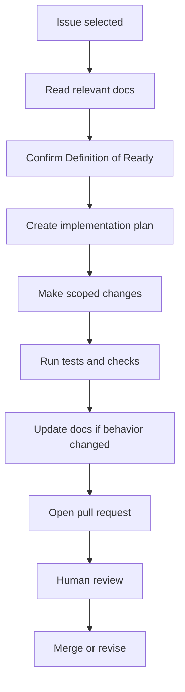

# AGENTS

## Purpose
Define how ChatGPT, Cursor, Devin, and human engineers should collaborate on this repository.

## Scope
Applies to product, architecture, data, RAG, frontend, backend, testing, and operations work.

## Current status
Initial coordination guide. Agent roles are recommended and may change after implementation begins.

## Operating principles
- Do not implement features without checking the relevant product, RAG, data, and architecture documents.
- Do not weaken citation, grounding, or evidence sufficiency behavior for convenience.
- Prefer small pull requests with tests and documentation updates.
- Keep MVP and future architecture separate.
- Do not introduce Neo4j, autonomous agents, or advanced contradiction detection as required MVP dependencies.
- Treat LLM output as untrusted until grounded, cited, and evaluated.

## Suggested agent roles
- Product agent: maintains requirements, user stories, roadmap, and acceptance criteria.
- Data agent: manages corpus selection, metadata, document processing, and data dictionary changes.
- RAG agent: owns chunking, retrieval, prompting, citation, sufficiency, and evaluation.
- Backend agent: owns FastAPI, persistence, migrations, and service interfaces.
- Frontend agent: owns Next.js user workflows and citation inspection UX.
- QA agent: owns test strategy, regression questions, and release verification.
- DevOps agent: owns Docker Compose, CI, deployment, backup, and observability.

## Agent task lifecycle

## Related documents
- [Agent workflow](docs/development/AGENT_WORKFLOW.md)
- [Definition of ready](docs/development/DEFINITION_OF_READY.md)
- [Definition of done](docs/development/DEFINITION_OF_DONE.md)
- [Pull request process](docs/development/PULL_REQUEST_PROCESS.md)

## Human decisions still required
- Confirm whether agents may create issues and branches autonomously.
- Confirm whether Devin owns long-running implementation tasks or only scoped tickets.
- Confirm review requirements for scientific content changes.

