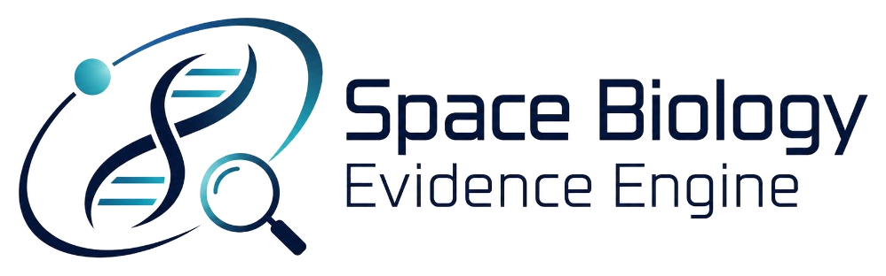

# Space Biology Evidence Engine



## Purpose
Define and build a citation-first evidence engine for a controlled corpus of open-access space biology publications.

## Final submission artifacts

This README is the central index for the final FAU AI HootCamp submission.

| Artifact | Link | Status |
| --- | --- | --- |
| Application | [Local demo instructions](docs/operations/HOW_TO_DEMO.md) | Complete; local-first, no public deployment URL |
| Demo video | Accessible hosted URL will be added after recording | Pending |
| Pitch deck (PowerPoint) | [12-slide deck with speaker notes](docs/final/Space_Biology_Evidence_Engine_Pitch_Deck.pptx) | Complete |
| Pitch deck (PDF) | [Pitch deck PDF](docs/final/Space_Biology_Evidence_Engine_Pitch_Deck.pdf) | Complete |
| One-page project summary | [PowerPoint](docs/final/Space_Biology_Evidence_Engine_One_Page_Summary.pptx) · [PDF](docs/final/Space_Biology_Evidence_Engine_One_Page_Summary.pdf) | Complete |
| Final release document | [Markdown](docs/final/FINAL_RELEASE.md) · [PDF](docs/final/FINAL_RELEASE.pdf) | Complete |
| Application screenshots | [Screenshot gallery](docs/final/screenshots/) | Complete |
| Project plan | [plan.md](plan.md) | Complete |
| Technical design | [design.md](design.md) | Complete |
| API documentation | [FastAPI OpenAPI and endpoint notes](docs/operations/LOCAL_SETUP.md#services-and-ports) | Complete |
| Architecture | [System architecture](docs/architecture/ARCHITECTURE.md) · [RAG architecture](docs/architecture/RAG_ARCHITECTURE.md) · [Deployment architecture](docs/architecture/DEPLOYMENT_ARCHITECTURE.md) | Complete |
| Setup and deployment | [Local setup](docs/operations/LOCAL_SETUP.md) · [Deployment](docs/operations/DEPLOYMENT.md) | Complete |
| Evaluation and testing | [Evaluation strategy](docs/rag/EVALUATION_STRATEGY.md) · [Testing strategy](docs/development/TESTING_STRATEGY.md) | Complete |
| Security and cost | [Security architecture](docs/architecture/SECURITY_ARCHITECTURE.md) · [Cost decisions](docs/governance/DECISION_LOG.md) | Complete |

John Hernandez has already specified that he will not participate in the live final showcase presentation. The complete deck, one-page summary, documentation, screenshots, and backup demo plan remain available for submission and evaluation.

## How to demo

This is a **small library of 23 approved space biology papers** (microgravity and skeletal muscle). It is **not** ChatGPT with the whole internet. Answers (when they work) must point at real passages from that library. If there is not enough evidence, the system is supposed to say so instead of guessing.

### Run it on your computer

You need [Docker](https://www.docker.com/) (for the database). `make api` and `make web` each **keep running** until you stop them, so they cannot share one terminal. Stop a server with **Ctrl-C**. Do not use Ctrl-Z (that parks the process and can leave port 8000 or 3000 busy).

**First time, in one terminal** (from this project folder). This finishes and gives the prompt back:

```bash
cp .env.example .env
make setup
```

`make setup` installs tools and starts the database. It does **not** download all the PDFs or turn on live Q&A.

**Then leave this running in that same window:**

```bash
make api    # backend — http://localhost:8000
```

**Open a new terminal window**, `cd` into the same project folder, and run:

```bash
make web    # website — http://localhost:3000
```

Open **http://localhost:3000** in a browser. Click-through script (10 search terms + 10 Ask questions): [docs/operations/HOW_TO_DEMO.md](docs/operations/HOW_TO_DEMO.md). Setup detail: [docs/operations/LOCAL_SETUP.md](docs/operations/LOCAL_SETUP.md).

### What to show (works today)

| Page | What you will see |
| --- | --- |
| Home | Buttons for Ask, Search, Corpus, Compare studies, Add paper |
| [Corpus](http://localhost:3000/corpus) | Cards for each paper (title, organism, exposure, link to the publisher) |
| [Add paper](http://localhost:3000/add) | Register a **local extra** by DOI or PDF, then **Index**. This does **not** add to the approved 23. Index extracts, chunks, and embeds — it does not train a model. Register success is not the same as indexed. |
| A publication | Extra details and DOI links |
| [Search](http://localhost:3000/search) | Catalog titles and labels. After `make ingest`, passages from the database if the API is running. |
| [Compare studies](http://localhost:3000/compare) | Check two or more papers. You will see organism / system labels (for example human vs mouse). The page does **not** invent “this study found more atrophy.” |

### What will not look like a full Q&A demo yet

- Paper PDFs are **not** stored in git (`data/pdfs/` is ignored).
- There is **`make fetch-pdfs`**: download the 23 approved OA PDFs into `data/pdfs/` from `august_mvp_corpus_manifest.csv`. Then **`make ingest`** indexes them into chunks. Search can show indexed passages when the API is up.
- **Ask** needs ingest plus embeddings, then a chat model. Default is **local Ollama** (`LLM_PROVIDER=ollama`, model `llama3.2:1b` — fastest small model). For a citation-following demo, use `llama3.2:3b` (`OLLAMA_MODEL=llama3.2:3b`) or paid `OPENAI_API_KEY`. Install Ollama, `ollama pull` the model, `ollama serve`, then restart `make api`. Without a model or an empty index, Ask fails closed instead of inventing an answer.
- On Ask, the **Answer** block is first; cited PDF quotes sit under **Supporting details** (not mixed with the paper title).
- **Add paper** (`/add`) registers **local extras** (`local_*`, pending review), not the approved 23. Paywalled licenses are rejected. Register success is not the same as indexed.

A fair demo: Corpus + Compare (no ingest), then **Download missing PDFs** / `make fetch-pdfs`, `make ingest`, Search passages, Ask with citations.

## Scope
The August MVP (deadline 2026-08-31) focuses on retrieval-augmented generation, passage-level citations, evidence sufficiency, and a controlled corpus of **23** open-access publications on **microgravity and skeletal muscle** (see [corpus inventory](docs/data/CORPUS_INVENTORY.md)). A **post-August** inventory compare UI is at `/compare`. Auth, public hosting, and a graph database are out of product (ADR-011 for graph DB).

## Repositories

| Role | Repository |
|------|------------|
| **Principal / development** | [bluefate/spacebio-evidence-engine](https://github.com/bluefate/spacebio-evidence-engine) |
| **Course submission (GitHub Classroom)** | [FAU-AI-HootCamp-Summer-2026/buildphase-bluefate](https://github.com/FAU-AI-HootCamp-Summer-2026/buildphase-bluefate) |

Development and day-to-day engineering happen in the principal repository. The Classroom repository is the official submission remote for AI HootCamp Summer 2026 and should stay in sync for plan, design, and incremental build deliverables.

## Development team

Humans and AI agents who contribute implementation work are listed here. **Agents must add themselves** the first time they open a PR for this repository (and may update their row on later PRs). Do not invent collaborators who have not contributed.

| Name | Type | Role | Notes |
|------|------|------|-------|
| John Hernandez ([@bluefate](https://github.com/bluefate)) | Human | Repository owner | Final authority on requirements, architecture, security, PR approval, and merge |
| Cursor Auto (Composer) | Agent (Cursor) | Implementation contributor | Claimed/implemented multiple MVP issues; follows [AGENTS.md](AGENTS.md) |
| Cursor Grok 4.5 | Agent (Cursor) | Implementation contributor | Follows [AGENTS.md](AGENTS.md) |
| Cursor Grok 4.6 | Agent (Cursor) | Implementation contributor | Follows [AGENTS.md](AGENTS.md) |
| Devin | Agent (Devin) | Implementation contributor | Follows [AGENTS.md](AGENTS.md) |
| Codex | Agent (Codex) | Implementation contributor | Follows [AGENTS.md](AGENTS.md) |
| Cascade | Agent (Cascade) | Implementation contributor | Follows [AGENTS.md](AGENTS.md) |

Rules for agents:

1. On your **first** implementation PR, add a row for yourself in this table (same PR).
2. Use a stable display name (for example `Cursor Auto (Composer)`, `Devin`, `Codex`) plus agent type.
3. Keep the Role short (`Implementation contributor`, `Docs contributor`, etc.).
4. Do not remove other people or agents.
5. If you are already listed, you do not need to edit this table again unless correcting your own row.

## Backlog and project (source of truth)

Weekly windows in [plan.md](plan.md) are **schedule targets**. Execution order, ownership, and status live on GitHub:

| Resource | URL |
|----------|-----|
| **GitHub Project** | [Space Biology Evidence Engine (project #6)](https://github.com/users/bluefate/projects/6) |
| **Issues** | [bluefate/spacebio-evidence-engine/issues](https://github.com/bluefate/spacebio-evidence-engine/issues) |
| **Backlog index** | [docs/governance/BACKLOG.md](docs/governance/BACKLOG.md) |

Claim and implement from Project status `Ready` per [AGENT_WORKFLOW.md](docs/development/AGENT_WORKFLOW.md).

## What to work next (and what can run in parallel)

**Live Mermaid board (agents must use this):** [docs/development/ACTIVE_BOARD.md](docs/development/ACTIVE_BOARD.md)
**Refresh command:** `make refresh-board` (pulls Project #6 Status + open PR branches into the Mermaid tree)
**Project board:** [Project #6](https://github.com/users/bluefate/projects/6)

### Parallel agents — do this every time

1. `make refresh-board`
2. Read **Next options** in [ACTIVE_BOARD.md](docs/development/ACTIVE_BOARD.md)
3. Claim **one** issue that is not **Do not claim** / not In flight
4. Claim comment + Project Status + branch ([AGENT_WORKFLOW.md](docs/development/AGENT_WORKFLOW.md))
5. `make refresh-board` again and commit `docs/development/ACTIVE_BOARD.md` in the same PR

**Rule:** one owner per issue; do not edit files owned by another active issue.

### Critical path (mostly serial)

| Order | Issue | Notes |
|------:|-------|-------|
| 1 | [#27](https://github.com/bluefate/spacebio-evidence-engine/issues/27) Publication metadata schema | **Done** (PR #84) |
| 2 | [#28](https://github.com/bluefate/spacebio-evidence-engine/issues/28) PDF storage abstraction | `parallel-safe` — check board before claiming |
| 3 | [#29](https://github.com/bluefate/spacebio-evidence-engine/issues/29) → [#30](https://github.com/bluefate/spacebio-evidence-engine/issues/30) → [#31](https://github.com/bluefate/spacebio-evidence-engine/issues/31) | PDF extract → sections → page mapping (after #28) |
| 4 | [#32](https://github.com/bluefate/spacebio-evidence-engine/issues/32) / [#33](https://github.com/bluefate/spacebio-evidence-engine/issues/33) | Chunking + chunk schema (`parallel-unsafe`) |
| 5 | [#39](https://github.com/bluefate/spacebio-evidence-engine/issues/39) → [#40](https://github.com/bluefate/spacebio-evidence-engine/issues/40) → [#42](https://github.com/bluefate/spacebio-evidence-engine/issues/42) → [#43](https://github.com/bluefate/spacebio-evidence-engine/issues/43) → [#44](https://github.com/bluefate/spacebio-evidence-engine/issues/44) | Embeddings → vector schema/index → search (**#39 Done**) |
| 6 | [#51](https://github.com/bluefate/spacebio-evidence-engine/issues/51)–[#60](https://github.com/bluefate/spacebio-evidence-engine/issues/60) | Grounded answer / `/ask` API |
| 7 | [#61](https://github.com/bluefate/spacebio-evidence-engine/issues/61)–[#66](https://github.com/bluefate/spacebio-evidence-engine/issues/66) | Web ask / evidence / citation UI |

### Typical parallel-safe picks

Use the refreshed board for what is free **now**. Common safe lanes:

| Issue | Why parallel-safe |
|-------|-------------------|
| [#40](https://github.com/bluefate/spacebio-evidence-engine/issues/40) Local embeddings | After #39; owns concrete provider files |
| [#51](https://github.com/bluefate/spacebio-evidence-engine/issues/51) LLM provider interface | Interface stubs (avoid `embeddings/` if #40 active) |
| [#26](https://github.com/bluefate/spacebio-evidence-engine/issues/26) Reference questions | Docs/eval only |
| [#23](https://github.com/bluefate/spacebio-evidence-engine/issues/23)–[#25](https://github.com/bluefate/spacebio-evidence-engine/issues/25) | Corpus QA / licenses / duplicates |
| [#57](https://github.com/bluefate/spacebio-evidence-engine/issues/57) / [#55](https://github.com/bluefate/spacebio-evidence-engine/issues/55) | Answer schema / insufficient evidence |
| [#6](https://github.com/bluefate/spacebio-evidence-engine/issues/6) / [#10](https://github.com/bluefate/spacebio-evidence-engine/issues/10) / [#11](https://github.com/bluefate/spacebio-evidence-engine/issues/11) | Setup / pytest / ruff polish |

### Do **not** parallelize without coordination

- [#32](https://github.com/bluefate/spacebio-evidence-engine/issues/32), [#33](https://github.com/bluefate/spacebio-evidence-engine/issues/33), [#42](https://github.com/bluefate/spacebio-evidence-engine/issues/42), [#43](https://github.com/bluefate/spacebio-evidence-engine/issues/43)
- Anything already in ACTIVE_BOARD **In flight**
- Second agent on `alembic/`, `src/spacebio_evidence_engine/db/`, or the same package path

### Corpus approval

The August MVP inventory (**23** publications) is owner-approved (`human_approval=approved` in the manifest; [#20](https://github.com/bluefate/spacebio-evidence-engine/issues/20) closed). Bulk ingest can proceed subject to license/PDF QA issues.

More detail: [docs/development/PARALLEL_WORK.md](docs/development/PARALLEL_WORK.md).

## Build Phase deliverables

| Document | Description |
|----------|-------------|
| [plan.md](plan.md) | Project plan: summary, requirements, RAG/production/security topics, weekly milestones |
| [design.md](design.md) | Technical design: architecture, data flow, user flow, schema, API, AI/RAG, deployment |

Supporting deep-dive documentation lives under [docs/](docs/README.md).

## Local setup

```bash
make setup
make setup-check
```

Then **two windows** (each command stays running; stop with Ctrl-C, not Ctrl-Z):

```bash
# window 1
make api    # http://localhost:8000

# window 2 (new terminal, same folder)
make web    # http://localhost:3000
```

Details (tools, ports, `.env.example`, clean-machine checklist):
[docs/operations/LOCAL_SETUP.md](docs/operations/LOCAL_SETUP.md).

**New to the project?** See [How to demo](#how-to-demo) for a plain-language walkthrough.

## Current status

August MVP **implementation is on `main`**: FastAPI, Next.js, PostgreSQL/pgvector,
ingestion/chunk/embed/search modules, grounded-answer schema and `/ask` route,
citation UI, study compare (`/compare`), optional hybrid retrieval and rerank
(off by default), experimental graph extractor (not on `/ask`). **No graph
database** (ADR-011).

Local `make setup` does **not** ingest the 23 PDFs. For live Ask, run
`make fetch-pdfs`, `make ingest`, install embeddings, and run **Ollama**
(`LLM_PROVIDER=ollama`, `ollama pull llama3.2:1b`). Paid OpenAI is optional.

## Architecture position
Accepted stack for the August MVP:

- Python 3.12+, FastAPI, PostgreSQL, pgvector, **SQLAlchemy 2.x + Alembic**, Pydantic API schemas, PyMuPDF, Sentence Transformers (`all-MiniLM-L6-v2`), optional OpenAI (`gpt-4o-mini`, **$50/mo hard cap**), Next.js, TypeScript, Docker Compose, Pytest, Ruff, **pyright**, GitHub Actions, Mermaid.
- Study compare UI **shipped** at `/compare` (inventory fields only; no `/compare` API).
- Hybrid retrieval and lexical rerank **exist** and are optional / off by default.
- **No Neo4j or other graph database** (ADR-011). Auth and public hosting remain deferred.
- Advanced multi-agent orchestration and advanced contradiction detection remain future capabilities.

## Start here
- [Build plan](plan.md)
- [Technical design](design.md)
- [Decision log](docs/governance/DECISION_LOG.md)
- [Documentation index](docs/README.md)
- [GitHub Project board](https://github.com/users/bluefate/projects/6)
- [Backlog index](docs/governance/BACKLOG.md)
- [Product requirements](docs/product/PRODUCT_REQUIREMENTS.md)
- [Architecture overview](docs/architecture/ARCHITECTURE.md)
- [RAG architecture](docs/architecture/RAG_ARCHITECTURE.md)
- [Development guide](docs/development/DEVELOPMENT_GUIDE.md)
- [Agent workflow](docs/development/AGENT_WORKFLOW.md)
- [Active board (Mermaid + next options)](docs/development/ACTIVE_BOARD.md)
- [Parallel work guide](docs/development/PARALLEL_WORK.md)
- [Development team](README.md#development-team)

## Related documents
- [Corpus specification](docs/data/CORPUS_SPECIFICATION.md)
- [Citation strategy](docs/rag/CITATION_STRATEGY.md)
- [Evaluation strategy](docs/rag/EVALUATION_STRATEGY.md)
- [Risk register](docs/governance/RISK_REGISTER.md)
- [Decision log](docs/governance/DECISION_LOG.md)

## Open follow-ons (do not block August MVP)
- Public hosting platform (deferred past local Compose demo).
- Production secret manager, observability stack, and user accounts (post-August).
