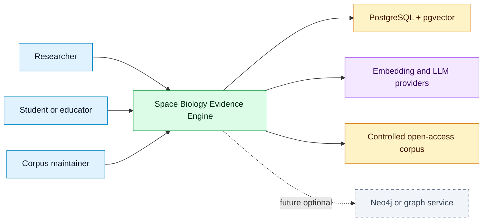
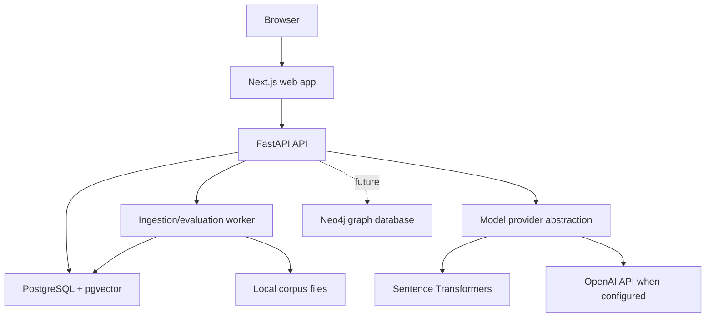
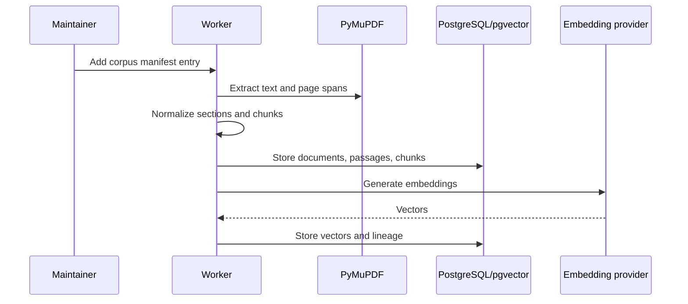
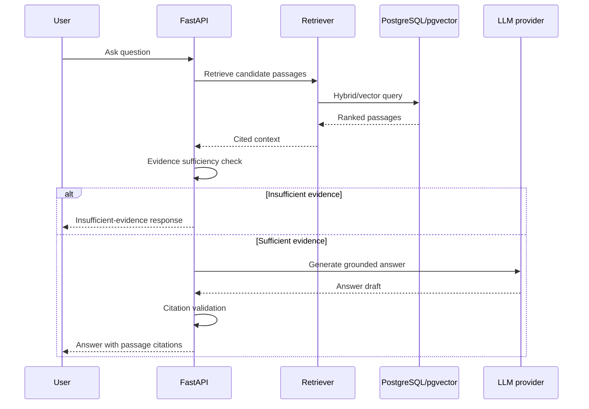
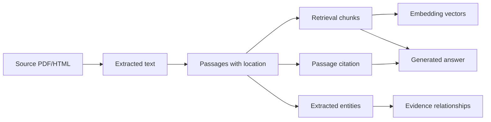
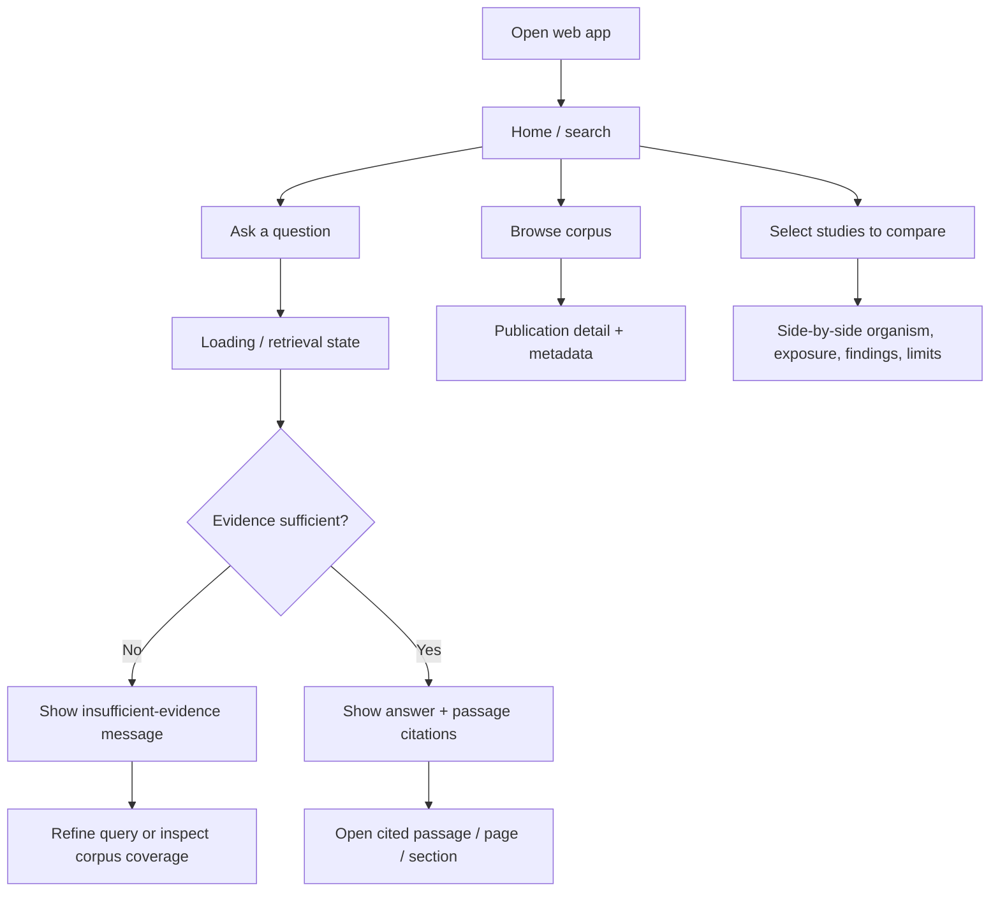
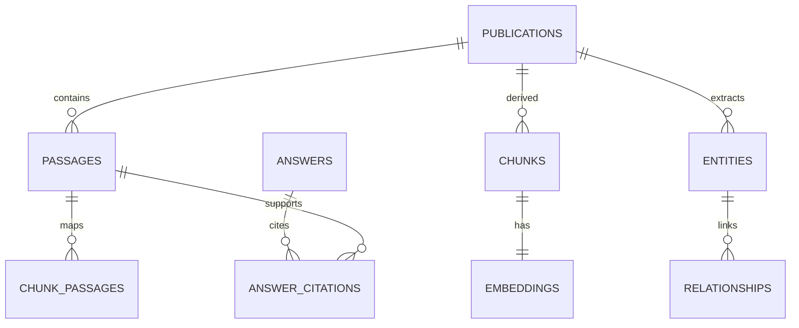
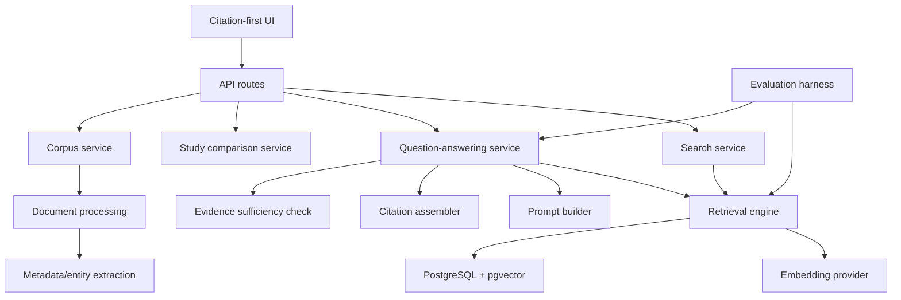
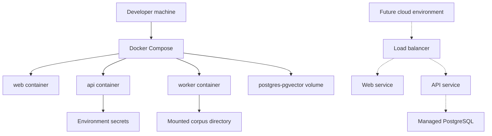

# Technical Design — Space Biology Evidence Engine

Living technical design for the AI HootCamp Summer 2026 Build Phase. Diagrams and schemas below are the assignment-facing summary; authoritative detail remains in [`docs/architecture/`](docs/architecture/ARCHITECTURE.md) and related packages.

Companion plan: [`plan.md`](plan.md).

## Repositories

| Role | Repository |
|------|------------|
| **Principal / development** | [bluefate/spacebio-evidence-engine](https://github.com/bluefate/spacebio-evidence-engine) |
| **Course submission (GitHub Classroom)** | [FAU-AI-HootCamp-Summer-2026/buildphase-bluefate](https://github.com/FAU-AI-HootCamp-Summer-2026/buildphase-bluefate) |

---

## 1. Design goals

1. Ground every scientific answer in retrieved corpus passages.
2. Preserve publication ID, title, section, page, and source location through the pipeline.
3. Separate source evidence, extracted structure, and generated interpretation.
4. Keep MVP operable on Docker Compose with optional cloud LLM providers.
5. Defer graph-native and heavy multi-agent complexity until justified.

---

## 2. System architecture



### Container view



**Detail:** [SYSTEM_CONTEXT.md](docs/architecture/SYSTEM_CONTEXT.md), [CONTAINER_ARCHITECTURE.md](docs/architecture/CONTAINER_ARCHITECTURE.md), [COMPONENT_ARCHITECTURE.md](docs/architecture/COMPONENT_ARCHITECTURE.md).

---

## 3. Data flow

### Ingestion



### Query / answer



### Lineage



**Detail:** [RAG_ARCHITECTURE.md](docs/architecture/RAG_ARCHITECTURE.md), [DATA_ARCHITECTURE.md](docs/architecture/DATA_ARCHITECTURE.md).

---

## 4. User flow



### Wireframe sketch (MVP screens)

| Screen | Purpose | Primary elements |
|--------|---------|------------------|
| Search / Ask | Natural-language Q&A | Query input, submit, loading, answer, citation list |
| Passage inspector | Verify claim | Passage text, publication title, section, page, source link |
| Corpus browser | Explore included papers | Table/list of publications, topic filters, license status |
| Study compare | Compare selected studies | Multi-select, comparison table of metadata/findings |
| Maintainer (CLI/UI light) | Ingest status | Manifest entries, ingestion status, extraction quality flags |

UI priority: **citation visibility over decorative chrome**. Cards only where they wrap an interaction (e.g., selectable study).

**Detail:** [USER_STORIES.md](docs/product/USER_STORIES.md).

---

## 5. Database schema

Logical MVP schema (implementation naming may use Alembic migrations). Vectors live in PostgreSQL via **pgvector**.

### Core tables

| Table | Key columns | Notes |
|-------|-------------|-------|
| `publications` | `publication_id`, `title`, `source_url`, `license_status`, `corpus_topic`, `ingestion_status`, `doi`, `year`, … | Controlled corpus unit |
| `passages` | `passage_id`, `publication_id`, `text`, `page_start`, `page_end`, `section_label`, `extraction_method` | Citation-addressable spans |
| `chunks` | `chunk_id`, `publication_id`, `passage_ids`, `chunk_text`, `embedding_model`, `chunking_strategy_version` | Retrieval units |
| `embeddings` | `chunk_id`, `embedding` (vector), `model_version` | pgvector index |
| `entities` | `entity_id`, `publication_id`, `type`, `value`, `provisional` | Organism, exposure, etc. |
| `relationships` | `relationship_id`, endpoints, `label`, `provisional` | Extracted structure; unverified until reviewed |
| `answers` / `answer_citations` | query, model, prompt version, citation IDs | Audit / eval support |
| `benchmark_questions` / `evaluation_runs` | question, expected citations, scores | Evaluation harness |

### Relationships (simplified)



### Indexes (initial)

- `publications(corpus_topic)`, `publications(ingestion_status)`
- `passages(publication_id)`, `passages(section_label)`
- `chunks(publication_id)`
- Vector index on `embeddings.embedding` (HNSW or IVFFlat — chosen at implementation)
- Optional full-text index on passage/chunk text for hybrid search

**Detail:** [METADATA_SCHEMA.md](docs/data/METADATA_SCHEMA.md), [DATA_DICTIONARY.md](docs/data/DATA_DICTIONARY.md), [DATA_ARCHITECTURE.md](docs/architecture/DATA_ARCHITECTURE.md).

---

## 6. API architecture

Base: FastAPI under `/api/v1` (exact prefix finalized at scaffolding). All scientific answer paths must be retrieval-backed.

| Method | Endpoint | Request (shape) | Response (shape) |
|--------|----------|-----------------|------------------|
| `GET` | `/health` | — | `{ "status": "ok" }` |
| `GET` | `/publications` | query: topic, status, limit | `{ "items": [Publication...] }` |
| `GET` | `/publications/{id}` | — | `Publication` + metadata |
| `POST` | `/search` | `{ "query": str, "top_k": int, "filters"?: object }` | `{ "results": [RankedPassage...] }` |
| `POST` | `/ask` | `{ "question": str, "top_k"?: int, "filters"?: object }` | `{ "answer": str, "citations": [...], "sufficiency": "ok"|"insufficient", "retrieval": {...} }` |
| `POST` | `/compare` | `{ "publication_ids": [str] }` | `{ "rows": [ComparisonField...] }` |
| `GET` | `/passages/{id}` | — | `Passage` with location fields |
| `POST` | `/ingest/runs` | `{ "manifest_entry_id": str }` | job status (maintainer) |
| `GET` | `/eval/benchmarks` | — | benchmark list (dev/eval) |

### Example `/ask` response

```json
{
  "answer": "…grounded text…",
  "sufficiency": "ok",
  "citations": [
    {
      "passage_id": "p_123",
      "publication_id": "pub_45",
      "title": "…",
      "section": "Results",
      "page_start": 4,
      "page_end": 4,
      "source_url": "https://…",
      "excerpt": "…"
    }
  ],
  "retrieval": {
    "chunk_ids": ["c_1", "c_2"],
    "scores": [0.81, 0.77]
  }
}
```

Error handling: structured JSON errors; timeouts on provider calls; user-friendly messages; never substitute uncited model knowledge on retrieval failure.

---

## 7. AI / RAG component diagram



### RAG design choices

| Concern | Decision |
|---------|----------|
| Vector DB | pgvector in PostgreSQL |
| Chunking | Section-aware, ~500–900 token overlap; versioned |
| Embeddings | Local Sentence Transformers by default |
| Generation | Provider abstraction; optional OpenAI |
| Citations | Passage-level; validate IDs against retrieved set |
| Failure mode | Insufficient-evidence response |
| Agents | Service/tool boundaries only in MVP; multi-agent deferred |

**Detail:** [docs/rag/](docs/rag/CHUNKING_STRATEGY.md), [PROMPTING_STRATEGY.md](docs/rag/PROMPTING_STRATEGY.md), [CITATION_STRATEGY.md](docs/rag/CITATION_STRATEGY.md).

---

## 8. Deployment architecture



| Environment | Topology |
|-------------|----------|
| **MVP** | Docker Compose: web, api, worker, postgres-pgvector; secrets via env |
| **Future hosted** | Managed PostgreSQL, container hosting, HTTPS, managed secrets, backups |

CI/CD intent: GitHub Actions for lint, typecheck, tests; no secrets in repo.

**Detail:** [DEPLOYMENT_ARCHITECTURE.md](docs/architecture/DEPLOYMENT_ARCHITECTURE.md), [DEPLOYMENT.md](docs/operations/DEPLOYMENT.md), [LOCAL_SETUP.md](docs/operations/LOCAL_SETUP.md).

---

## 9. Security and observability (design hooks)

| Area | Design |
|------|--------|
| Secrets | Env vars; server-side provider keys; redacted logs |
| Input | Treat PDF/HTML text as untrusted; no execution of extracted content |
| Data access | ORM/parameterized queries; least-privilege DB roles when practical |
| Auth | Not required for local MVP; add before public multi-user hosting if needed |
| Observability | Request logs; retrieval IDs/scores; prompt version; ingestion summaries; eval outputs |

**Detail:** [SECURITY_ARCHITECTURE.md](docs/architecture/SECURITY_ARCHITECTURE.md), [OBSERVABILITY.md](docs/architecture/OBSERVABILITY.md).

---

## 10. Major technical decisions (rationale)

| Decision | Choice | Rationale |
|----------|--------|-----------|
| Application pattern | RAG with passage citations | Scientific trust requires provenance |
| API | FastAPI | Python-native RAG/ingest/eval stack |
| DB + vectors | PostgreSQL + pgvector | One operational surface for MVP corpus size |
| Separate vector SaaS | Deferred | Unnecessary cost/complexity for ~20–30 papers |
| Frontend | Next.js + TypeScript | Strong path for citation inspection UX |
| Graph DB (Neo4j) | Deferred | Graph useful later; not MVP-critical |
| LLM access | Provider abstraction | Local/dev vs cloud without rewrite |
| Multi-agent orchestration | Deferred | Focus on retrieval quality and citations first |
| Auth provider | TBD if hosting requires accounts | Local MVP can be open; harden for public deploy |
| Deploy platform | Compose now; cloud host TBD | Matches current approved architecture |

Tracked formally in [DECISION_LOG.md](docs/governance/DECISION_LOG.md).

---

## 11. Open decisions

- SQLAlchemy vs SQLModel
- mypy vs pyright
- Initial embedding model and top-k / rerank defaults
- Public deployment host (if required for demo)
- Whether user accounts are in MVP scope for hosted environments
- Final license confirmation (Apache-2.0 proposed)

---

## 12. Change log

| Date | Change |
|------|--------|
| 2026-08-04 | Initial Build Phase `design.md` created from existing architecture package |
