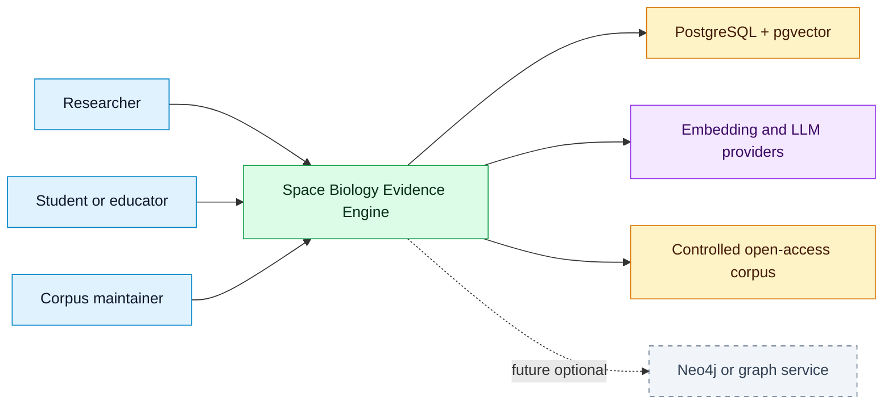
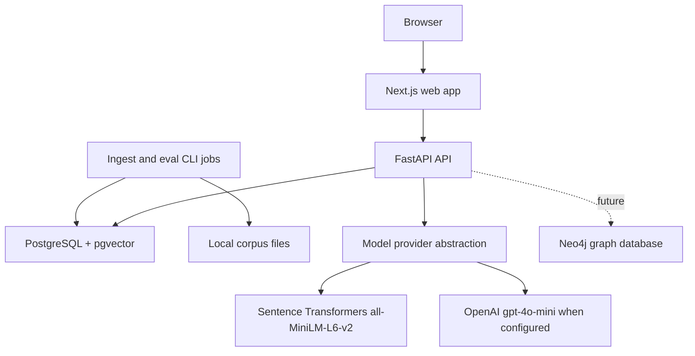
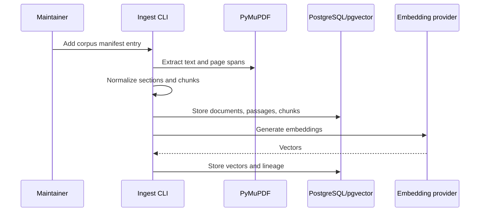
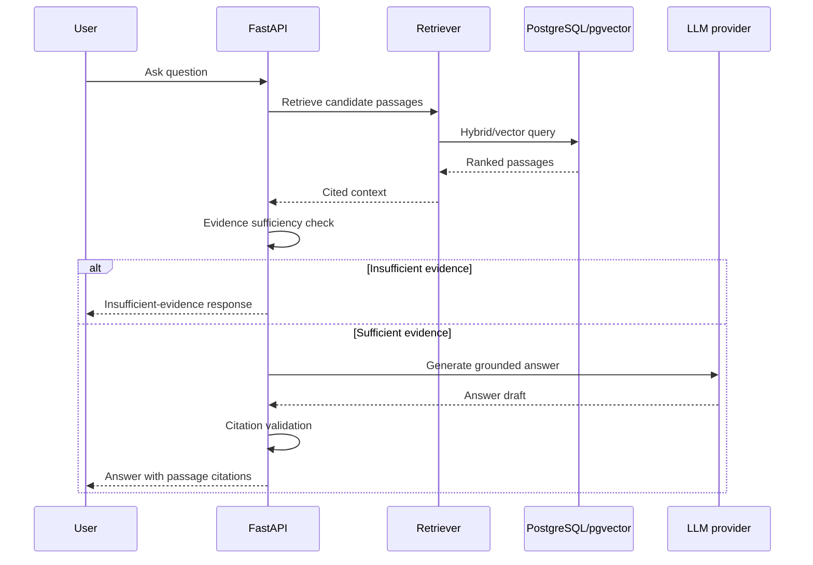
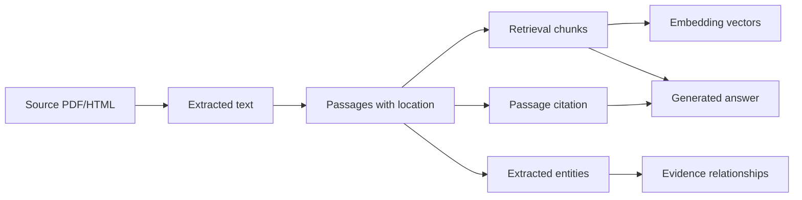
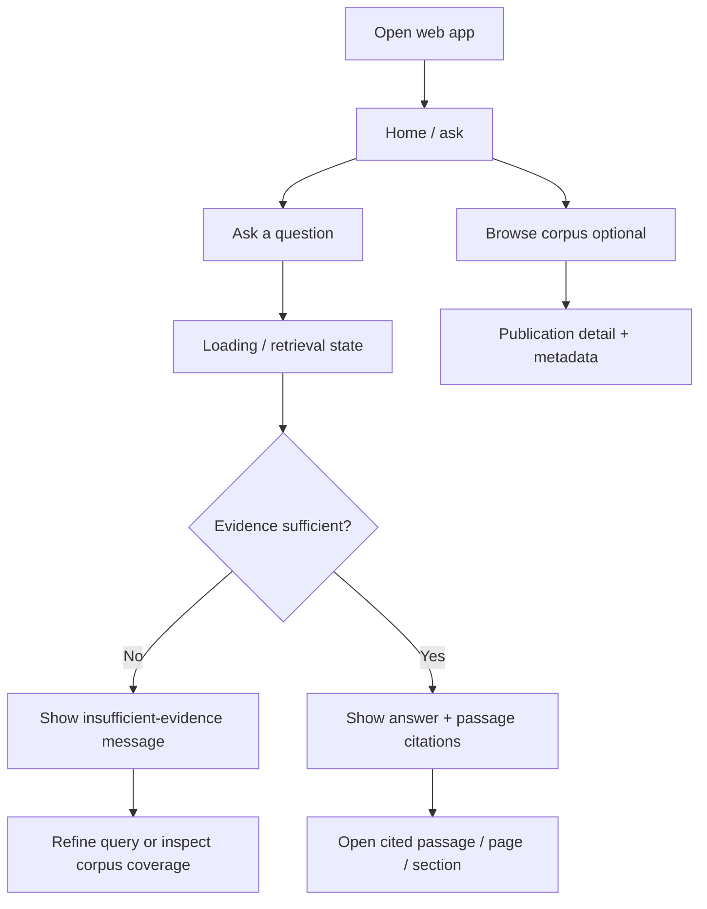
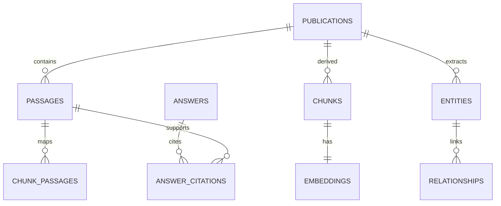
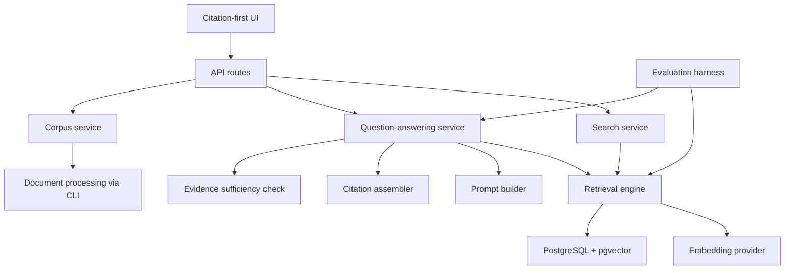
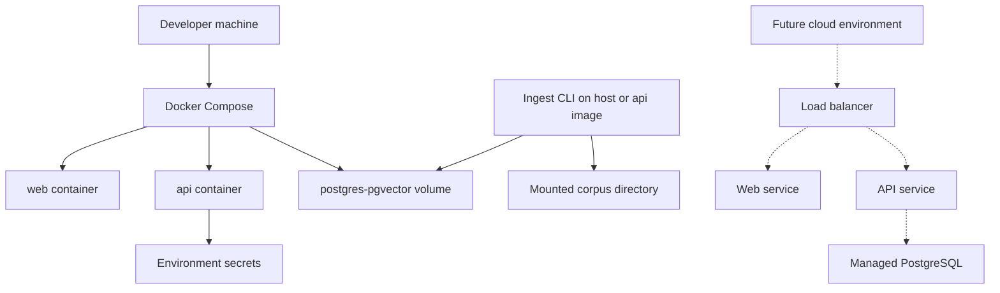

# Technical Design — Space Biology Evidence Engine

Living technical design for the AI HootCamp Summer 2026 Build Phase. Diagrams and schemas below are the assignment-facing summary; authoritative detail remains in [`docs/architecture/`](docs/architecture/ARCHITECTURE.md) and related packages.

Companion plan: [`plan.md`](plan.md).  
Locked decisions: [`docs/governance/DECISION_LOG.md`](docs/governance/DECISION_LOG.md).  
**August MVP deadline:** 2026-08-31.

## Repositories

| Role | Repository |
|------|------------|
| **Principal / development** | [bluefate/spacebio-evidence-engine](https://github.com/bluefate/spacebio-evidence-engine) |
| **Course submission (GitHub Classroom)** | [FAU-AI-HootCamp-Summer-2026/buildphase-bluefate](https://github.com/FAU-AI-HootCamp-Summer-2026/buildphase-bluefate) |

## Backlog and project (source of truth)

| Resource | URL |
|----------|-----|
| **GitHub Project** | [Space Biology Evidence Engine (project #6)](https://github.com/users/bluefate/projects/6) |
| **Issues** | [bluefate/spacebio-evidence-engine/issues](https://github.com/bluefate/spacebio-evidence-engine/issues) |
| **Backlog index** | [docs/governance/BACKLOG.md](docs/governance/BACKLOG.md) |
| **Build plan** | [plan.md](plan.md) |

---

## 1. Design goals

1. Ground every scientific answer in retrieved corpus passages.
2. Preserve publication ID, title, section, page, and source location through the pipeline.
3. Separate source evidence, extracted structure, and generated interpretation.
4. Keep August MVP operable on Docker Compose with optional cloud LLM providers ($50/mo hard cap).
5. Keep graph-native persistence, authentication, and public hosting outside the local-first MVP; study comparison and optional hybrid retrieval are implemented without weakening provenance.

---

## 2. System architecture



### Container view



August MVP containers: `web`, `api`, `db`. Ingestion and evaluation run as **CLI/jobs**, not a separate always-on worker.

**Detail:** [SYSTEM_CONTEXT.md](docs/architecture/SYSTEM_CONTEXT.md), [CONTAINER_ARCHITECTURE.md](docs/architecture/CONTAINER_ARCHITECTURE.md), [COMPONENT_ARCHITECTURE.md](docs/architecture/COMPONENT_ARCHITECTURE.md).

---

## 3. Data flow

### Ingestion



### Query / answer



### Lineage



**Detail:** [RAG_ARCHITECTURE.md](docs/architecture/RAG_ARCHITECTURE.md), [DATA_ARCHITECTURE.md](docs/architecture/DATA_ARCHITECTURE.md).

---

## 4. User flow



### Wireframe sketch (August MVP screens)

| Screen | Purpose | Primary elements |
|--------|---------|------------------|
| Ask | Natural-language Q&A | Query input, submit, loading, answer, citation list |
| Passage inspector | Verify claim | Passage excerpt, title, section, page, source link |
| Corpus list (light) | See included papers | Title, topic, license/ingestion status |
| Study compare | Inventory UI at `/compare` (#65) | Organism/system labels; no `/compare` API |
| Maintainer | CLI ingest jobs | Manifest entries, status, extraction quality flags — **no `make ingest` yet** |

UI priority: **citation visibility over decorative chrome**.

**Detail:** [USER_STORIES.md](docs/product/USER_STORIES.md).

---

## 5. Database schema

Logical MVP schema (implementation naming may use Alembic migrations). Vectors live in PostgreSQL via **pgvector**.

### Core tables

| Table | Key columns | Notes |
|-------|-------------|-------|
| `publications` | `publication_id`, `title`, `source_url`, `license_status`, `corpus_topic`, `ingestion_status`, `doi`, `year`, … | Controlled corpus unit |
| `passages` | `passage_id`, `publication_id`, `text`, `page_start`, `page_end`, `section_label`, `extraction_method` | Citation-addressable spans |
| `chunks` | `chunk_id`, `publication_id`, `passage_ids`, `chunk_text`, `embedding_model`, `chunking_strategy_version` | Retrieval units |
| `embeddings` | `chunk_id`, `embedding` (vector), `model_version` | pgvector index |
| `entities` | `entity_id`, `publication_id`, `type`, `value`, `provisional` | Organism, exposure, etc. |
| `relationships` | `relationship_id`, endpoints, `label`, `provisional` | Extracted structure; unverified until reviewed |
| `answers` / `answer_citations` | query, model, prompt version, citation IDs | Audit / eval support |
| `benchmark_questions` / `evaluation_runs` | question, expected citations, scores | Evaluation harness |

### Relationships (simplified)



### Indexes (initial)

- `publications(corpus_topic)`, `publications(ingestion_status)`
- `passages(publication_id)`, `passages(section_label)`
- `chunks(publication_id)`
- Vector index on `embeddings.embedding` (HNSW or IVFFlat — chosen at implementation)
- Optional full-text index on passage/chunk text for hybrid search

**Detail:** [METADATA_SCHEMA.md](docs/data/METADATA_SCHEMA.md), [DATA_DICTIONARY.md](docs/data/DATA_DICTIONARY.md), [DATA_ARCHITECTURE.md](docs/architecture/DATA_ARCHITECTURE.md).

---

## 6. API architecture

Base: FastAPI under `/api/v1` (exact prefix finalized at scaffolding). All scientific answer paths must be retrieval-backed.

| Method | Endpoint | Request (shape) | Response (shape) |
|--------|----------|-----------------|------------------|
| `GET` | `/health` | — | `{ "status": "ok" }` |
| `GET` | `/publications` | query: topic, status, limit | `{ "items": [Publication...] }` |
| `GET` | `/publications/{id}` | — | `Publication` + metadata |
| `POST` | `/search` | `{ "query": str, "top_k": int, "filters"?: object }` | `{ "results": [RankedPassage...] }` |
| `POST` | `/ask` | `{ "question": str, "top_k"?: int, "filters"?: object }` | `{ "answer": str, "citations": [...], "sufficiency": "ok"|"insufficient", "retrieval": {...} }` |
| `GET` | `/passages/{id}` | — | `Passage` with location fields |
| `POST` | `/compare` | — | **Not implemented** (compare is a web inventory page, not this API) |
| CLI | `ingest` / `eval` jobs | manifest entry / benchmark run | status on stdout / DB rows |

### Example `/ask` response

```json
{
  "answer": "…grounded text…",
  "sufficiency": "ok",
  "citations": [
    {
      "passage_id": "p_123",
      "publication_id": "pub_45",
      "title": "…",
      "section": "Results",
      "page_start": 4,
      "page_end": 4,
      "source_url": "https://…",
      "excerpt": "…"
    }
  ],
  "retrieval": {
    "chunk_ids": ["c_1", "c_2"],
    "scores": [0.81, 0.77]
  }
}
```

Error handling: structured JSON errors; timeouts on provider calls; user-friendly messages; never substitute uncited model knowledge on retrieval failure.

---

## 7. AI / RAG component diagram



### RAG design choices (locked)

| Concern | Decision |
|---------|----------|
| Vector DB | pgvector in PostgreSQL |
| Chunking | Section-aware, ~500–900 tokens, ~10–20% overlap; versioned |
| Embeddings | Local `all-MiniLM-L6-v2` |
| Retrieval | Vector-only; top-k 8; no hybrid/reranker in August |
| Generation | Provider abstraction; optional OpenAI `gpt-4o-mini`; $50/mo hard cap |
| Citations | Passage-level; validate IDs against retrieved set |
| Failure mode | Insufficient-evidence response |
| Agents | Service boundaries only; multi-agent deferred |
| Compare / entities | Deferred past August |

**Detail:** [docs/rag/](docs/rag/CHUNKING_STRATEGY.md), [PROMPTING_STRATEGY.md](docs/rag/PROMPTING_STRATEGY.md), [CITATION_STRATEGY.md](docs/rag/CITATION_STRATEGY.md).

---

## 8. Deployment architecture



| Environment | Topology |
|-------------|----------|
| **August MVP** | Docker Compose: web, api, postgres-pgvector; CLI ingest; secrets via env |
| **Future hosted** | Managed PostgreSQL, container hosting, HTTPS, managed secrets, backups |

CI/CD intent: GitHub Actions for lint, typecheck, tests; no secrets in repo.

**Detail:** [DEPLOYMENT_ARCHITECTURE.md](docs/architecture/DEPLOYMENT_ARCHITECTURE.md), [DEPLOYMENT.md](docs/operations/DEPLOYMENT.md), [LOCAL_SETUP.md](docs/operations/LOCAL_SETUP.md).

---

## 9. Security and observability (design hooks)

| Area | Design |
|------|--------|
| Secrets | Env vars; server-side provider keys; redacted logs |
| Input | Treat PDF/HTML text as untrusted; no execution of extracted content |
| Data access | ORM/parameterized queries; least-privilege DB roles when practical |
| Auth | Out of August MVP (anonymous local use) |
| Observability | Request logs; retrieval IDs/scores; prompt version (bodies redacted); ingestion summaries; eval outputs |

**Detail:** [SECURITY_ARCHITECTURE.md](docs/architecture/SECURITY_ARCHITECTURE.md), [OBSERVABILITY.md](docs/architecture/OBSERVABILITY.md).

---

## 10. Major technical decisions (rationale)

| Decision | Choice | Rationale |
|----------|--------|-----------|
| Application pattern | RAG with passage citations | Scientific trust requires provenance |
| API | FastAPI | Python-native RAG/ingest/eval stack |
| ORM | SQLAlchemy 2.x + Alembic; Pydantic API schemas | Mature migrations; clear layers |
| Type checker | pyright | Primary checker for FastAPI/Pydantic |
| DB + vectors | PostgreSQL + pgvector | One operational surface for ~10–15 papers |
| Separate vector SaaS | Deferred | Unnecessary cost/complexity |
| Embeddings | `all-MiniLM-L6-v2` local | $0 cloud embeddings |
| LLM | Optional OpenAI `gpt-4o-mini`; $50/mo hard cap | Bound spend; local $0 mode |
| Frontend | Next.js + TypeScript | Citation inspection UX |
| Graph DB (Neo4j) | **No** (ADR-011 / #77) | Not in Compose or `/ask` |
| Study compare | Inventory UI `/compare` (#65) | Does not invent findings |
| Multi-agent orchestration | Deferred | Focus on retrieval quality and citations |
| Auth | Out of August MVP | Anonymous local use |
| Deploy platform | Local Compose only for August | Public host deferred |
| License | Apache-2.0 | Confirmed |

Tracked formally in [DECISION_LOG.md](docs/governance/DECISION_LOG.md).

---

## 11. Deferred decisions (post-August)

- Public hosting platform
- Production secret manager / observability stack
- User accounts / IAM
- Expert-reviewed expansion beyond the approved 23-publication corpus
- Per-file ADR documents (single decision log for now)

Corpus PDF fetch/ingest, wired `GroundedAnswerService`, hybrid retrieval (#46), optional rerank (#48), and study comparison are implemented. Graph extraction remains experimental; a graph database is rejected for the MVP (ADR-011).

---

## 12. Change log

| Date | Change |
|------|--------|
| 2026-08-04 | Initial Build Phase `design.md` created from existing architecture package |
| 2026-08-17 | As-built: compare UI, optional hybrid/rerank, ADR-010/011 (no graph DB); local `/ask` still unwired |
| 2026-08-26 | Final as-built sync: PDF fetch/ingest, wired grounded Ask, Ollama/OpenAI paths, 23-paper corpus, and final submission artifacts |
