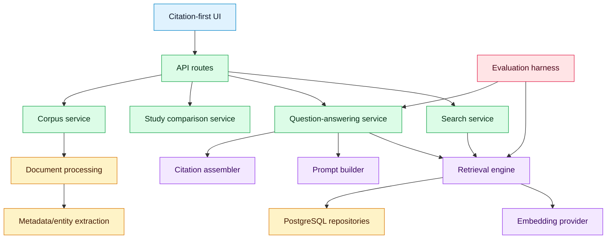

# Component Architecture

## Purpose
Define major software components and their responsibilities.

## Scope
Backend, frontend, RAG, data, and evaluation components for MVP.

## Current status
Initial component map.

## Diagram

## MVP components
Use modular Python packages for ingestion, retrieval, RAG orchestration, citation assembly, extraction, persistence, and evaluation. API request/response schemas use Pydantic directly (not SQLModel-derived schemas); persistence uses SQLAlchemy 2.x.

## Future components
Curated graph services, contradiction review, and evidence grading should be separate modules.

## Related documents
- [RAG architecture](RAG_ARCHITECTURE.md)
- [Data architecture](DATA_ARCHITECTURE.md)
- [Testing strategy](../development/TESTING_STRATEGY.md)

## Decision status
Resolved for August MVP (deadline 2026-08-31) or deferred post-August. See [decision log](../governance/DECISION_LOG.md).

