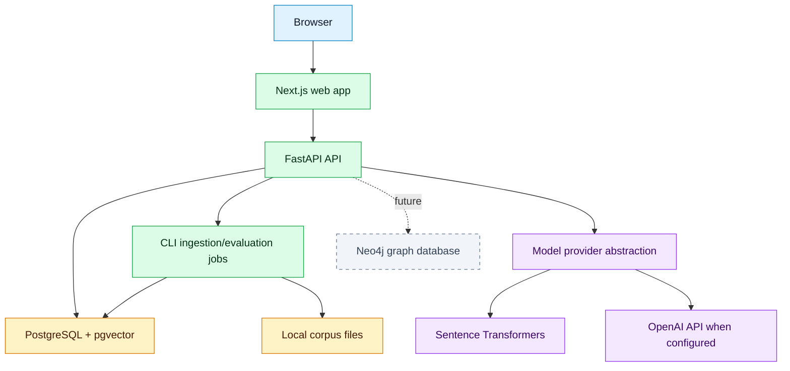

# Container Architecture

## Purpose
Define deployable application containers for local and future environments.

## Scope
MVP containers with future additions noted separately.

## Current status
Initial container model.

## Diagram

## MVP containers
- `web`: Next.js TypeScript application.
- `api`: FastAPI backend.
- `db`: PostgreSQL with pgvector.
- Ingestion, embedding, and evaluation run as CLI jobs from the API container (no separate always-on worker for August MVP).

## Future containers
- `graph`: Neo4j or graph API.
- `observability`: metrics, traces, and dashboards.

## Related documents
- [Component architecture](COMPONENT_ARCHITECTURE.md)
- [Deployment architecture](DEPLOYMENT_ARCHITECTURE.md)
- [Local setup](../operations/LOCAL_SETUP.md)

## Decision status
Resolved for August MVP (deadline 2026-08-31) or deferred post-August. August MVP uses CLI/jobs for ingestion and evaluation, not a separate always-on worker container. See [decision log](../governance/DECISION_LOG.md).

