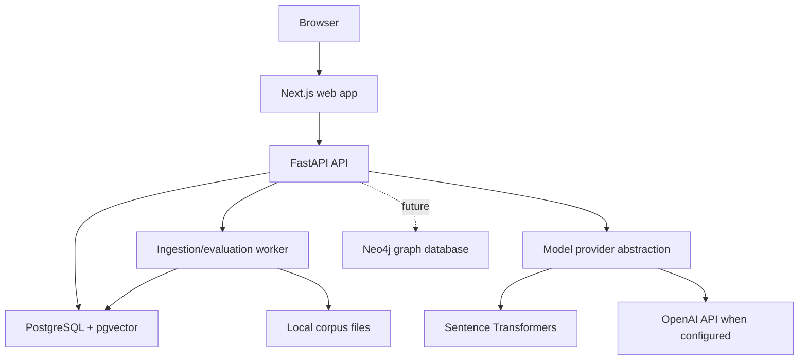

# Container Architecture

## Purpose
Define deployable application containers for local and future environments.

## Scope
MVP containers with future additions noted separately.

## Current status
Initial container model.

## Diagram

## MVP containers
- `web`: Next.js TypeScript application.
- `api`: FastAPI backend.
- `db`: PostgreSQL with pgvector.
- `worker`: ingestion, embedding, and evaluation jobs.

## Future containers
- `graph`: Neo4j or graph API.
- `observability`: metrics, traces, and dashboards.

## Related documents
- [Component architecture](COMPONENT_ARCHITECTURE.md)
- [Deployment architecture](DEPLOYMENT_ARCHITECTURE.md)
- [Local setup](../operations/LOCAL_SETUP.md)

## Human decisions still required
- Decide whether worker is a separate process in MVP or a CLI module.
- Approve Docker image standards.

