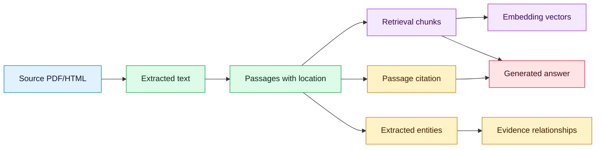

# Data Architecture

## Purpose
Define how documents, metadata, chunks, embeddings, citations, and extracted facts are stored and traced.

## Scope
MVP PostgreSQL architecture with future graph architecture noted separately.

## Current status
Initial data architecture.

## Data lineage

## MVP storage
PostgreSQL stores documents, sources, passages, chunks, embeddings, entities, relationships, benchmark questions, evaluation results, and answer logs.

## Database bootstrap (issue #8)

Local Compose uses the `pgvector/pgvector:pg16` image (`docker-compose.yml`).

1. **Fresh volumes:** SQL under `scripts/db/init/` is mounted at `/docker-entrypoint-initdb.d` and runs once on first init. It enables `CREATE EXTENSION IF NOT EXISTS vector` only — no application tables yet.
2. **Existing volumes / smoke check:** run `make db-bootstrap` (`scripts/bootstrap_pgvector.py`). The script is idempotent and uses `DATABASE_URL` or `POSTGRES_*` from `.env`.
3. **Publication schema (issue #27):** Alembic revision `20260805_0001` creates the `publications` table (identifiers, license, paths, ingest/approval state). ORM: `spacebio_evidence_engine.db.models.Publication`. Apply with `make migrate`.
4. **Chunk schema (issue #33):** Alembic revision `20260806_0002` creates the `chunks` table (text, section, page/offsets, content hash, FK to publications). ORM: `spacebio_evidence_engine.db.models.Chunk`.
5. **Vector storage (issue #42):** Alembic revision `20260806_0003` creates `chunk_embeddings` with a `vector(384)` column (MVP = local MiniLM). Depends on the PostgreSQL `vector` extension from #8. ORM: `spacebio_evidence_engine.db.models.ChunkEmbedding`. Indexing/search APIs are #43/#44.
6. **Later schema:** Follow-on issues add passage tables and vector indexes. Do not put those in the #8 bootstrap scripts.

### Embedding vector storage (issue #42)

| Concern | Decision |
| --- | --- |
| Table | `chunk_embeddings` (1:1 with `chunks.chunk_id`, `ON DELETE CASCADE`) |
| Column | `embedding vector(384)` on PostgreSQL |
| Dimension | **384** — matches `LocalEmbeddingProvider` / `all-MiniLM-L6-v2` |
| Lineage | `model_name` + `dimension` columns; `dimension` constrained to 384 |
| Extension | `CREATE EXTENSION IF NOT EXISTS vector` (also ensured by migration; Compose bootstrap #8 must still run for local DB) |
| Optional OpenAI | 1536-d OpenAI vectors are **not** stored in this MVP column; separate storage would be a follow-on if needed |
| SQLite CI | Migration stores JSON text instead of `vector` so `alembic upgrade head` works in fast tests |

Apply: `make migrate` (or `alembic upgrade head`) after `make db-bootstrap` on Compose Postgres.

Connection settings are documented in `.env.example` (`DATABASE_URL`, `POSTGRES_*`).

## Future storage
Neo4j may be introduced when graph traversal, visualization, or relationship curation exceeds PostgreSQL adjacency-query needs.

## Related documents
- [Data dictionary](../data/DATA_DICTIONARY.md)
- [Metadata schema](../data/METADATA_SCHEMA.md)
- [Corpus specification](../data/CORPUS_SPECIFICATION.md)

## Decision status
Resolved for August MVP (deadline 2026-08-31) or deferred post-August. See [decision log](../governance/DECISION_LOG.md).

