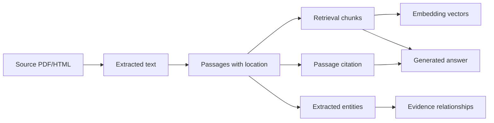

# Data Architecture

## Purpose
Define how documents, metadata, chunks, embeddings, citations, and extracted facts are stored and traced.

## Scope
MVP PostgreSQL architecture with future graph architecture noted separately.

## Current status
Initial data architecture.

## Data lineage

## MVP storage
PostgreSQL stores documents, sources, passages, chunks, embeddings, entities, relationships, benchmark questions, evaluation results, and answer logs.

## Future storage
Neo4j may be introduced when graph traversal, visualization, or relationship curation exceeds PostgreSQL adjacency-query needs.

## Related documents
- [Data dictionary](../data/DATA_DICTIONARY.md)
- [Metadata schema](../data/METADATA_SCHEMA.md)
- [Corpus specification](../data/CORPUS_SPECIFICATION.md)

## Human decisions still required
- Approve whether extracted relationships are treated as provisional until human reviewed.
- Approve retention policy for prompts and answer logs.

