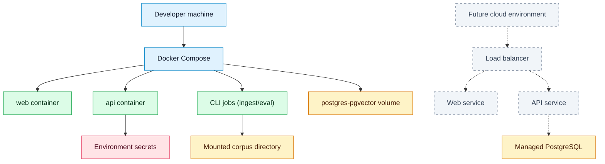

# Deployment Architecture

## Purpose
Describe local and future deployment topology.

## Scope
Docker Compose for MVP; cloud deployment as future architecture.

## Current status
Initial deployment plan.

## Diagram

## MVP deployment
Local Docker Compose is the only August MVP deployment target (deadline 2026-08-31). Public cloud hosting is deferred post-August.

## Future deployment
Cloud deployment may use managed PostgreSQL, managed secrets, container hosting, and object storage.

## Related documents
- [Operations deployment](../operations/DEPLOYMENT.md)
- [Local setup](../operations/LOCAL_SETUP.md)
- [Security architecture](SECURITY_ARCHITECTURE.md)

## Decision status
Resolved for August MVP (deadline 2026-08-31) or deferred post-August. See [decision log](../governance/DECISION_LOG.md).

