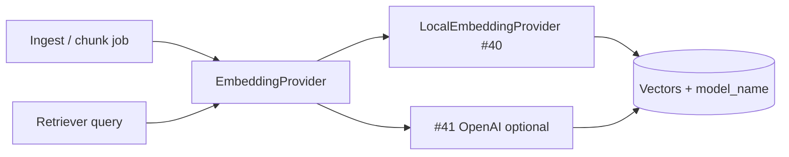
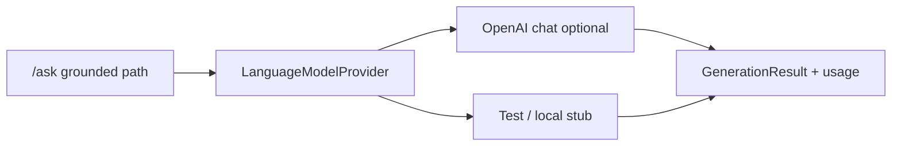
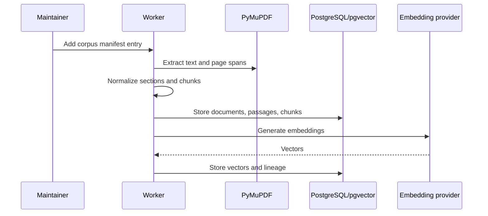
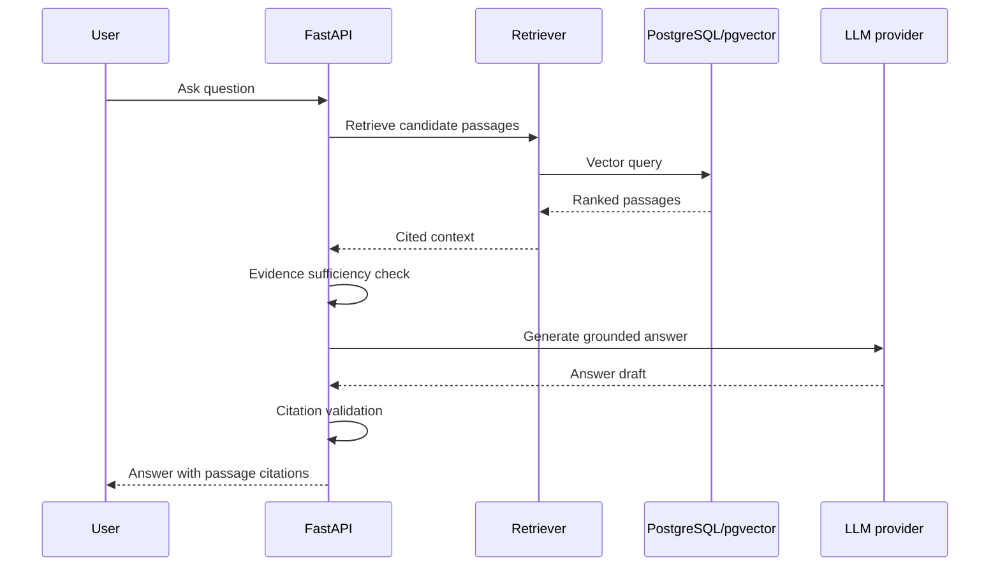

# RAG Architecture

## Purpose
Define how retrieval-augmented generation grounds answers in controlled publications.

## Scope
Ingestion, retrieval, answer generation, citations, and sufficiency behavior.

## Current status
Initial RAG architecture. Embedding **provider interface** is defined (issue #39). **Local** Sentence Transformers provider is implemented (issue #40, `LocalEmbeddingProvider`). Optional OpenAI embeddings remain issue #41. **LLM provider interface** is defined (issue #51, `LanguageModelProvider`); concrete OpenAI/local chat providers are follow-on work.

## Embedding provider interface

Embeddings are accessed only through `spacebio_evidence_engine.embeddings.EmbeddingProvider`:

| Member | Role |
| --- | --- |
| `model_name` | Stable model id stored with vectors for lineage |
| `dimension` | Fixed output length for all vectors from the provider |
| `embed_documents(texts)` | Batch-embed chunk/passage texts |
| `embed_query(text)` | Embed a single retrieval query |

Rules:

- Call sites depend on the abstract interface, not on Sentence Transformers or OpenAI SDKs.
- The interface module must not import provider-specific packages.
- Local implementation: `LocalEmbeddingProvider` (`embeddings/local.py`), default `all-MiniLM-L6-v2` (D4). Install with `pip install -e ".[embeddings]"`.
- Optional OpenAI embeddings stay behind a separate implementation (#41).

## Language model provider interface

Grounded generation goes through `spacebio_evidence_engine.llm.LanguageModelProvider` only:

| Member / type | Role |
| --- | --- |
| `model_name` | Stable model id for logs / cost tracking |
| `generate(GenerateRequest)` | Single-prompt completion |
| `chat(ChatRequest)` | Multi-turn chat completion |
| `GenerateRequest` / `ChatRequest` | Optional `structured_output` (JSON Schema map) |
| `GenerationResult` | `text`, optional `structured`, optional `UsageMetadata` |
| `UsageMetadata` | Optional `prompt_tokens` / `completion_tokens` / `total_tokens` (+ `extra`) |

Rules:

- Call sites depend on the ABC, not on OpenAI or other vendor SDKs.
- The interface module must not import provider-specific packages.
- MVP default remains optional OpenAI `gpt-4o-mini` behind a future concrete provider (D4 / ADR-006); local/$0 mode may use a stub or disabled path.

## Ingestion sequence

## Query sequence

## MVP RAG requirements
- Controlled corpus only.
- Citation-preserving chunks.
- Vector-only semantic retrieval (default top-k 8; hybrid keyword deferred post-August).
- Grounded generation.
- Insufficient-evidence response path.
- Evaluation with benchmark questions.

## Related documents
- [Chunking strategy](../rag/CHUNKING_STRATEGY.md)
- [Retrieval strategy](../rag/RETRIEVAL_STRATEGY.md)
- [Prompting strategy](../rag/PROMPTING_STRATEGY.md)
- [Citation strategy](../rag/CITATION_STRATEGY.md)
- [Evaluation strategy](../rag/EVALUATION_STRATEGY.md)

## Decision status
Resolved for August MVP (deadline 2026-08-31) or deferred post-August. See [decision log](../governance/DECISION_LOG.md).

