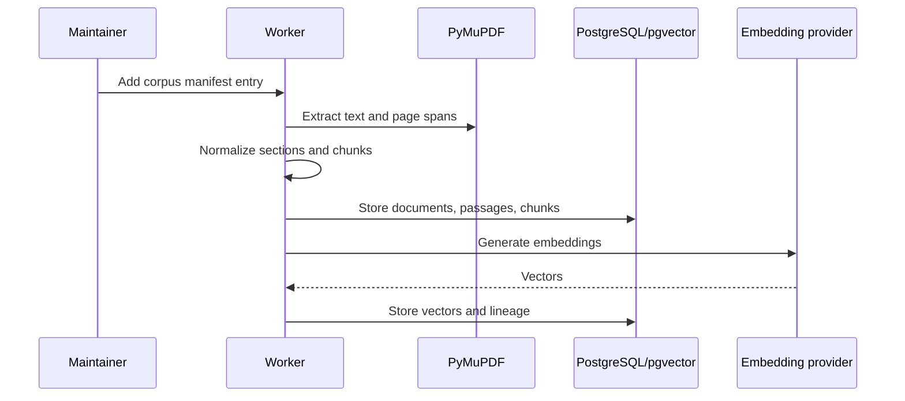
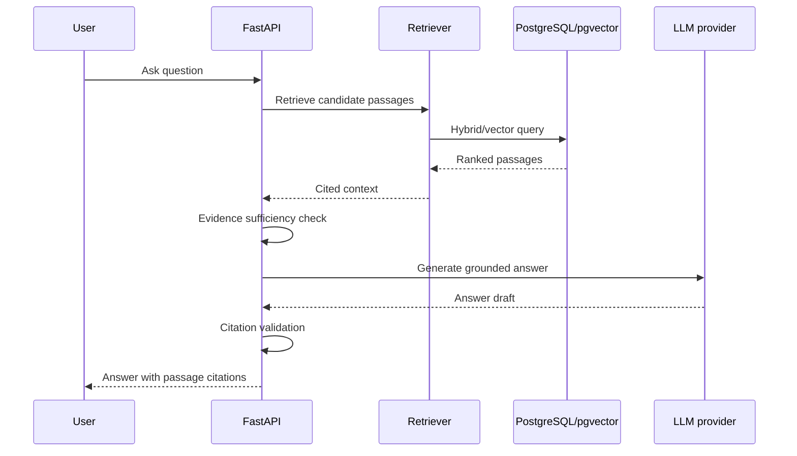

# RAG Architecture

## Purpose
Define how retrieval-augmented generation grounds answers in controlled publications.

## Scope
Ingestion, retrieval, answer generation, citations, and sufficiency behavior.

## Current status
Initial RAG architecture.

## Ingestion sequence

## Query sequence

## MVP RAG requirements
- Controlled corpus only.
- Citation-preserving chunks.
- Semantic retrieval with optional hybrid keyword support.
- Grounded generation.
- Insufficient-evidence response path.
- Evaluation with benchmark questions.

## Related documents
- [Chunking strategy](../rag/CHUNKING_STRATEGY.md)
- [Retrieval strategy](../rag/RETRIEVAL_STRATEGY.md)
- [Prompting strategy](../rag/PROMPTING_STRATEGY.md)
- [Citation strategy](../rag/CITATION_STRATEGY.md)
- [Evaluation strategy](../rag/EVALUATION_STRATEGY.md)

## Human decisions still required
- Approve top-k defaults and reranking approach.
- Approve model provider selection.
- Approve minimum citation validation thresholds.

