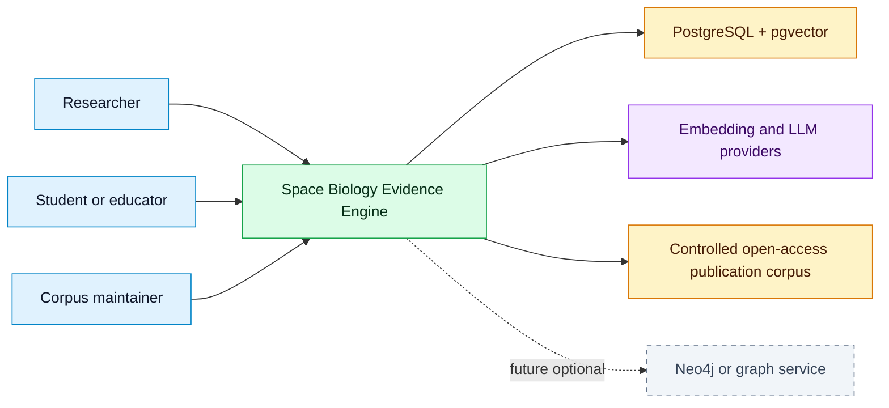

# System Context

## Purpose
Show how users and external systems interact with the evidence engine.

## Scope
MVP context and future context.

## Current status
Initial context model.

## Diagram

## MVP context
Users access the web app anonymously for local August MVP. The backend retrieves controlled-corpus passages from PostgreSQL and calls configured model providers (local Sentence Transformers embeddings; optional OpenAI LLM) through abstractions.

## Future context
Graph-native services, curator interfaces, external repository integrations, and additional corpora may be added after MVP.

## Related documents
- [Architecture overview](ARCHITECTURE.md)
- [Container architecture](CONTAINER_ARCHITECTURE.md)
- [Security architecture](SECURITY_ARCHITECTURE.md)

## Decision status
Resolved for August MVP (deadline 2026-08-31) or deferred post-August. See [decision log](../governance/DECISION_LOG.md).

