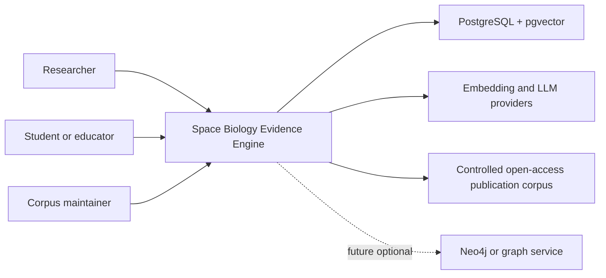

# System Context

## Purpose
Show how users and external systems interact with the evidence engine.

## Scope
MVP context and future context.

## Current status
Initial context model.

## Diagram

## MVP context
Users access the web app. The backend retrieves controlled-corpus passages from PostgreSQL and calls configured model providers through abstractions.

## Future context
Graph-native services, curator interfaces, external repository integrations, and additional corpora may be added after MVP.

## Related documents
- [Architecture overview](ARCHITECTURE.md)
- [Container architecture](CONTAINER_ARCHITECTURE.md)
- [Security architecture](SECURITY_ARCHITECTURE.md)

## Human decisions still required
- Confirm whether anonymous public users are supported.
- Confirm allowed external model providers.

