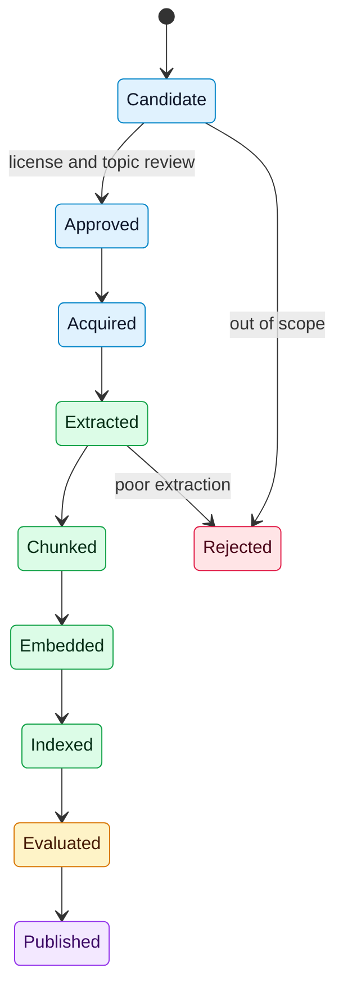

# Document Processing

## Purpose
Define how source publications become searchable, citable evidence.

## Scope
MVP PDF-first processing using PyMuPDF, with future extraction improvements.

## Current status
PDF storage (#28) and page-level text extraction (#29) are implemented for the MVP path. Section-aware chunking and embedding remain downstream.

## Document state flow


## MVP processing steps
- Register source in corpus manifest.
- Verify access and license status.
- Extract text with PyMuPDF (body text only for August MVP; tables and figures deferred post-August).
- Preserve page numbers and section hints.
- Normalize text.
- Create citation-preserving passages and chunks.
- Generate embeddings.
- Store lineage and processing status.

## PDF storage

Source PDFs are persisted through a storage abstraction before extraction.

- `PDFStorage` protocol defines `put`, `get`, `exists`, and `delete`.
- The default `local` backend (`LocalFileStorage`) writes files under `PDF_STORAGE_LOCAL_ROOT` (default `data/pdfs`) and requires no cloud SDK.
- The storage key returned by `put` is recorded on the publication record for later retrieval.
- Cloud/object backends can be added behind the same protocol but are not required for the MVP.
- Local PDF roots under `data/pdfs/` are gitignored so ingested binaries stay out of version control.

## PDF text extraction (issue #29)

Page-ordered plain text is extracted with PyMuPDF (`fitz`). Install via `dev` (CI / local validate) or the feature extra:

```bash
pip install -e ".[dev]"
# or
pip install -e ".[ingestion]"
```
API surface (`spacebio_evidence_engine.ingestion`):

- `extract_pdf_bytes(data)` — extract from in-memory PDF bytes
- `extract_pdf_path(path)` — extract from a filesystem path
- `extract_pdf_from_storage(storage, key)` — `storage.get(key)` then extract
- Return type: `ExtractionResult` with `pages: tuple[ExtractedPage, ...]` (`page_number` 1-based, `text`), `page_count`, optional `source_key`, and `full_text`

Typed failures:

- `PDFOpenError` — empty bytes, unreadable path/key, or non-PDF/corrupt input
- `PDFEmptyError` — opens but has no pages or no extractable text
- `PDFExtractionError` — base class / unexpected extraction failures

Security:

- Treat PDF bytes as untrusted. Extraction uses `fitz.open(..., filetype="pdf")` and `page.get_text("text")` only.
- Do not execute JavaScript, launch embedded files, or run content derived from the PDF.

Fixture coverage: `tests/fixtures/sample_two_page.pdf` and `tests/test_pdf_extraction.py`.

## Related documents
- [Chunking strategy](../rag/CHUNKING_STRATEGY.md)
- [Data architecture](../architecture/DATA_ARCHITECTURE.md)
- [Corpus specification](CORPUS_SPECIFICATION.md)

## Decision status
Resolved for August MVP (deadline 2026-08-31) or deferred post-August. See [decision log](../governance/DECISION_LOG.md).

