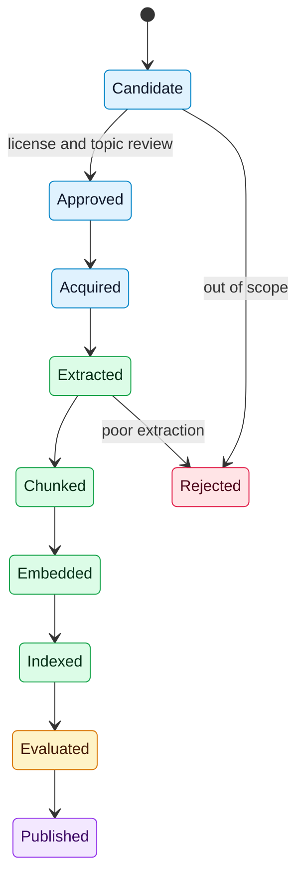

# Document Processing

## Purpose
Define how source publications become searchable, citable evidence.

## Scope
MVP PDF-first processing using PyMuPDF, with future extraction improvements.

## Current status
PDF storage (#28), page-level text extraction (#29), section detection (#30), page mapping (#31), and section-aware chunking (#32) are implemented for the MVP path. Chunk persistence (#33), embeddings, and ingestion status tracking (#34) are in place for the MVP path.

## Document state flow


## MVP processing steps
- Register source in corpus manifest.
- Verify access and license status.
- Extract text with PyMuPDF (body text only for August MVP; tables and figures deferred post-August).
- Preserve page numbers and section hints.
- Normalize text.
- Create citation-preserving passages and chunks.
- Generate embeddings.
- Store lineage and processing status.

## PDF storage

Source PDFs are persisted through a storage abstraction before extraction.

- `PDFStorage` protocol defines `put`, `get`, `exists`, and `delete`.
- The default `local` backend (`LocalFileStorage`) writes files under `PDF_STORAGE_LOCAL_ROOT` (default `data/pdfs`) and requires no cloud SDK.
- The storage key returned by `put` is recorded on the publication record for later retrieval.
- Cloud/object backends can be added behind the same protocol but are not required for the MVP.
- Local PDF roots under `data/pdfs/` are gitignored so ingested binaries stay out of version control.

## PDF text extraction (issue #29)

Page-ordered plain text is extracted with PyMuPDF (`fitz`). Install via `dev` (CI / local validate) or the feature extra:

```bash
pip install -e ".[dev]"
# or
pip install -e ".[ingestion]"
```
API surface (`spacebio_evidence_engine.ingestion`):

- `extract_pdf_bytes(data)` — extract from in-memory PDF bytes
- `extract_pdf_path(path)` — extract from a filesystem path
- `extract_pdf_from_storage(storage, key)` — `storage.get(key)` then extract
- Return type: `ExtractionResult` with `pages: tuple[ExtractedPage, ...]` (`page_number` 1-based, `text`), `page_count`, optional `source_key`, and `full_text`

Typed failures:

- `PDFOpenError` — empty bytes, unreadable path/key, or non-PDF/corrupt input
- `PDFEmptyError` — opens but has no pages or no extractable text
- `PDFExtractionError` — base class / unexpected extraction failures


## Ingestion status tracking (issue #34)

Per-publication ingestion state is persisted on `publications.ingestion_status`
and changed only through explicit transitions in
`spacebio_evidence_engine.ingestion.status`.

### Status enum

| Status | Meaning |
| --- | --- |
| `not_ingested` | Default. Ingest has not started (schema default). |
| `pending` | Queued for ingestion. |
| `processing` | Ingest job is actively running. |
| `succeeded` | Ingest completed successfully. |
| `failed` | Ingest failed; see structured errors (#36). |
| `pdf_quality_blocked` | Blocked by PDF quality assessment (#25). |

### Transitions

Allowed transitions are enforced by `transition_ingestion_status(...)`.
Invalid transitions raise `InvalidIngestionStatusTransitionError` and do not
persist. Every accepted transition is:

- written to `publications.ingestion_status`
- appended to an in-process event log (`IngestionStatusEventLog`)
- emitted as a structured log line (`ingestion_status_transition ...`)

Typical happy path: `not_ingested` → `processing` → `succeeded`.
Reprocessing may move `succeeded` or `failed` back to `pending`/`processing`.

### Operator lookup

Show status for a publication ID:

```bash
python scripts/show_ingestion_status.py \
  --database-url "$DATABASE_URL" \
  --publication-id pub_001
```

Add `--json` for a machine-readable snapshot including recent in-process
transitions and allowed next statuses.

## Ingestion error reporting (issue #36)

Structured ingestion errors are created through
`spacebio_evidence_engine.ingestion.error_reporting`.

- `IngestionErrorRecord` stores `publication_id`, ingestion `stage`, sanitized
  `message`, UTC `occurred_at`, stable `error_id`, and optional redacted details.
- `InMemoryIngestionErrorStore` provides a local operator-visible store for
  deterministic jobs and tests.
- `failure_status_for_publication(publication_id)` returns a failed status linked
  to the latest stored error record.
- Common secret-bearing fields and token-like values are redacted before storage.

Durable status transitions are owned by issue #34 (`transition_ingestion_status`);
this error store remains the local operator-visible failure detail surface.

Security:

- Treat PDF bytes as untrusted. Extraction uses `fitz.open(..., filetype="pdf")` and `page.get_text("text")` only.
- Do not execute JavaScript, launch embedded files, or run content derived from the PDF.

Fixture coverage: `tests/fixtures/sample_two_page.pdf` and `tests/test_pdf_extraction.py`.

## Section detection (issue #30)

Heuristic heading detection over extracted plain text (`spacebio_evidence_engine.ingestion.sections`).

- `detect_sections(extraction)` — from `ExtractionResult` (page offsets preserved)
- `detect_sections_from_text(text, page_starts=...)` — from a string (tests / callers)
- Returns `SectionDetectionResult` with ordered `SectionSpan` values: `label`, `text`, `start_offset` / `end_offset`, optional `start_page` / `end_page`, `heading_text`, `heading_matched`

Labels: `abstract`, `introduction`, `methods`, `results`, `discussion`, `conclusion`, `references`, `acknowledgements`, `supplementary`, and `unknown`.

Rules:

- Only label a span when a heading line matches; **do not invent** missing Methods/Results/etc.
- Leading text before the first heading is `unknown` (safe catch-all).
- `abstract_is_not_full_study` is always `True` — downstream must not treat abstract spans as a complete study.

Fixture coverage: `tests/test_section_detection.py`.

## Page mapping (issue #31)

`ExtractionResult.page_map` returns a `PageOffsetMap` aligned to `full_text`:

- `page_starts`: `(char_offset, page_number)` pairs for non-empty pages
- `page_number_for_offset(offset)`: 1-based page, or `None` when offset is unknown / out of range
- Section detection reuses `extraction.page_map.page_starts` (no duplicate join logic)

## PDF quality assessment (issue #25)

Before a publication is committed to ingestion, its source PDF is assessed for extractability. This is a lightweight, local-only check over the downloaded bytes; it does not perform OCR.

### Quality rubric

| Category | Criteria | Ingestion disposition |
|---|---|---|
| `good` | Readable text layer, page density >= 300 chars/page, <= 25% empty pages | Proceed to extraction |
| `poor_text` | Text present but low density (100-300 chars/page) or 25-60% empty pages | Proceed with caution; note in manifest |
| `needs_ocr` | Image-only, blank (no text/images), >60% empty pages, or density < 100 chars/page | Block ingestion (`pdf_quality_blocked`); flag for OCR follow-up |
| `corrupt` | Cannot be opened or parsed as a PDF | Block ingestion (`pdf_quality_blocked`) |
| `missing` | URL unreachable, returned non-PDF, or no PDF URL | Block ingestion (`pdf_quality_blocked`) |

### Usage

Assess a single PDF:

```python
from spacebio_evidence_engine.ingestion.pdf_quality import assess_pdf_path

result = assess_pdf_path("data/pdfs/pub_001.pdf")
print(result.category, result.notes)
```

Assess a publication by URL with a EuropePMC fallback:

```python
from spacebio_evidence_engine.ingestion.pdf_quality import score_publication_pdf

result = score_publication_pdf(
    "https://www.nature.com/articles/s41526-024-00406-3.pdf",
    pmcid="PMC11153545",
)
```

Run the corpus-wide assessment script to populate the manifest:

```bash
python3 scripts/assess_corpus_pdf_quality.py
```

This updates `data/inventory/august_mvp_corpus_manifest.csv` with `pdf_quality`
and `pdf_quality_notes` for each row, and sets `ingestion_status` to
`pdf_quality_blocked` for `needs_ocr`, `corrupt`, and `missing` categories.


## Related documents
- [Chunking strategy](../rag/CHUNKING_STRATEGY.md)
- [Data architecture](../architecture/DATA_ARCHITECTURE.md)
- [Corpus specification](CORPUS_SPECIFICATION.md)

## Decision status
Resolved for August MVP (deadline 2026-08-31) or deferred post-August. See [decision log](../governance/DECISION_LOG.md).
