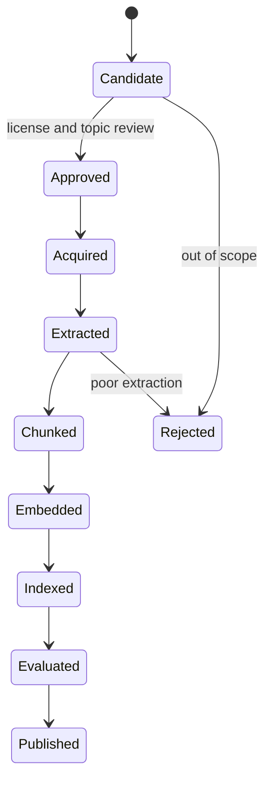

# Document Processing

## Purpose
Define how source publications become searchable, citable evidence.

## Scope
MVP PDF-first processing using PyMuPDF, with future extraction improvements.

## Current status
Initial processing design.

## Document state flow

## MVP processing steps
- Register source in corpus manifest.
- Verify access and license status.
- Extract text with PyMuPDF.
- Preserve page numbers and section hints.
- Normalize text.
- Create citation-preserving passages and chunks.
- Generate embeddings.
- Store lineage and processing status.

## Related documents
- [Chunking strategy](../rag/CHUNKING_STRATEGY.md)
- [Data architecture](../architecture/DATA_ARCHITECTURE.md)
- [Corpus specification](CORPUS_SPECIFICATION.md)

## Human decisions still required
- Define minimum extraction quality threshold.
- Decide whether tables and figures are MVP scope.

