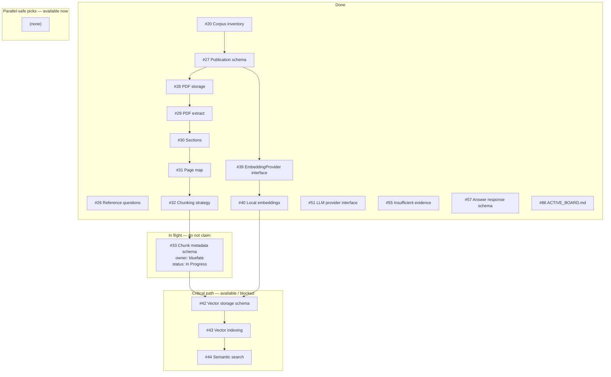

# Active board (agent next-task view)

## Purpose

Give humans and agents a single Mermaid view of **cleared work**, **in-flight branches**, and **recommended next issues**. Use this file when deciding what to claim next.

## Source of truth

| Layer | Authority |
| --- | --- |
| [GitHub Project #6](https://github.com/users/bluefate/projects/6) | Live Status (`Ready`, `Claimed`, `In Progress`, `PR Open`, `Done`) |
| [GitHub issues](https://github.com/bluefate/spacebio-evidence-engine/issues) | Scope, assignees, claim comments |
| **This file** | Shared snapshot regenerated by `make refresh-board` |

If this file disagrees with the Project board, **trust the Project board**, then run `make refresh-board` and commit the result.

## Auto-refresh (required)

The Mermaid tree and **Next options** table below are **machine-generated**. Do not hand-edit inside the `ACTIVE_BOARD:BEGIN` / `ACTIVE_BOARD:END` markers.

### Command

```bash
make refresh-board
```

This runs `scripts/refresh_active_board.py`, which:

1. Reads Status (+ assignees) from [Project #6](https://github.com/users/bluefate/projects/6)
2. For in-flight issues without assignees, reads the newest issue **CLAIMED BY** claim comment
3. Reads open PR branch names linked to tracked issues
4. Rebuilds the Mermaid subgraphs (`Done` / `In flight` / critical / parallel), including `owner:` on in-flight nodes
5. Rebuilds the **Next options** priority table

### When agents must refresh

| Event | Action |
| --- | --- |
| Before claiming | Read this file (and optionally refresh if it looks stale) |
| After claim comment + Project Status → Claimed / In Progress | `make refresh-board` → commit in the same PR |
| When opening or updating a PR | `make refresh-board` → include in the PR |
| After a human merges and clears a task | Next agent (or follow-up docs commit) runs `make refresh-board` so Done moves on the tree |
| Asking “what’s next?” | Run `make refresh-board`, then present the Mermaid + Next options table |

### How agents must use this file

1. Read this file **before claiming**.
2. Prefer Priority `1+` rows that are **not** marked **Do not claim**.
3. Claim via [AGENT_WORKFLOW.md](AGENT_WORKFLOW.md) (comment + Project Status + branch).
4. Run **`make refresh-board`** and commit `ACTIVE_BOARD.md` in the same PR.
5. Paste the updated Mermaid (or link this file) in the PR / handoff so other agents see the new menu.

### Extending the tracked set

Edit `TRACKED` and `CRITICAL_EDGES` in [`scripts/refresh_active_board.py`](../../scripts/refresh_active_board.py), then re-run `make refresh-board`.

<!-- ACTIVE_BOARD:BEGIN -->
**Last refreshed:** 2026-08-05 via `make refresh-board` (Project #6 + open PRs).

## Live board (auto-generated)



## Next options (auto-generated — pick one)

Agents: choose **one** issue, claim it, run `make refresh-board`, commit this file in the same PR.

| Priority | Issue | Status | When to take it | Avoid if… |
| ---: | --- | --- | --- | --- |
| — | [#42](https://github.com/bluefate/spacebio-evidence-engine/issues/42) Vector storage schema | Planning | Wait on #33 | Blocked |
| — | [#43](https://github.com/bluefate/spacebio-evidence-engine/issues/43) Vector indexing | Planning | Wait on #42 | Blocked |
| — | [#44](https://github.com/bluefate/spacebio-evidence-engine/issues/44) Semantic search | Planning | Wait on #43 | Blocked |
| — | [#33](https://github.com/bluefate/spacebio-evidence-engine/issues/33) Chunk metadata schema | In Progress | In flight (bluefate; `(branch on issue claim)`) | **Do not claim** |

<!-- ACTIVE_BOARD:END -->

## Branch naming reminder

One branch per issue:

- `feature/<n>-…` / `fix/<n>-…` / `docs/<n>-…` / `test/<n>-…` / `chore/<n>-…`

Open PRs named with the issue number are picked up automatically by `make refresh-board`.

## Do not start without coordination

- Second owner on in-flight issues shown above
- Competing edits under `alembic/` or `src/spacebio_evidence_engine/db/`
- Files listed on another issue’s claim comment
- `#32`, `#33`, `#42`, `#43` without checking parallel-unsafe overlap

## Related documents

- [Parallel work guide](PARALLEL_WORK.md) — concurrency rules
- [Agent workflow](AGENT_WORKFLOW.md) — claim / PR procedure
- [Backlog index](../governance/BACKLOG.md)
- [Project board](https://github.com/users/bluefate/projects/6)
- [README — What to work next](../../README.md#what-to-work-next-and-what-can-run-in-parallel)
