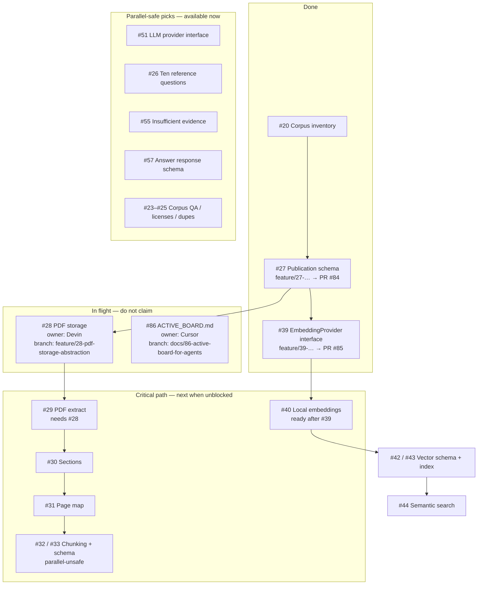

# Active board (agent next-task view)

## Purpose

Give humans and agents a single Mermaid view of **cleared work**, **in-flight branches**, and **recommended next issues**. Use this file when deciding what to claim next.

## Source of truth

| Layer | Authority |
| --- | --- |
| [GitHub Project #6](https://github.com/users/bluefate/projects/6) | Live Status (`Ready`, `Claimed`, `In Progress`, `PR Open`, `Done`) |
| [GitHub issues](https://github.com/bluefate/spacebio-evidence-engine/issues) | Scope, assignees, claim comments |
| **This file** | Shared snapshot + Mermaid + next-option menu for agents |

If this file disagrees with the Project board, **trust the Project board**, then update this file in the same PR that claims or closes work.

## How agents must use this file

1. Read this file **before claiming**.
2. Prefer a row from **Next options (pick one)** that is not already In flight.
3. Claim via [AGENT_WORKFLOW.md](AGENT_WORKFLOW.md) (comment + Project Status + branch).
4. **Update this file in the same PR** when you claim, open a PR, or merge/clear a task:
   - Move the issue node between Mermaid subgraphs.
   - Set the branch name on In-flight nodes.
   - Refresh the **Next options** table.
5. Present the updated Mermaid + next options in your handoff / PR summary so other agents see the new menu.

## Live board (snapshot)

**Last updated:** 2026-08-05 (after #39 / PR #85 merged; #28 Devin; #86 active-board docs)

## Next options (pick one)

Agents: choose **one** issue, claim it, then edit this table so others do not double-claim.

| Priority | Issue | When to take it | Avoid if… |
| ---: | --- | --- | --- |
| 1 | [#40](https://github.com/bluefate/spacebio-evidence-engine/issues/40) Local embedding provider | #39 Done — unblocks vector path | Another agent owns `embeddings/` |
| 2 | [#51](https://github.com/bluefate/spacebio-evidence-engine/issues/51) LLM provider interface | Want parallel RAG stubs | Overlap with #40 files |
| 3 | [#26](https://github.com/bluefate/spacebio-evidence-engine/issues/26) Reference questions | Docs/eval only | — |
| 4 | [#57](https://github.com/bluefate/spacebio-evidence-engine/issues/57) / [#55](https://github.com/bluefate/spacebio-evidence-engine/issues/55) Answer schema / insufficient evidence | Grounded-answer stubs | — |
| 5 | [#29](https://github.com/bluefate/spacebio-evidence-engine/issues/29) PDF extract | **Only after #28 merges** | #28 still In flight |
| — | [#28](https://github.com/bluefate/spacebio-evidence-engine/issues/28) PDF storage | Already claimed by Devin | **Do not claim** |
| — | [#86](https://github.com/bluefate/spacebio-evidence-engine/issues/86) Active board docs | This PR | **Do not claim** |

## Branch naming reminder

One branch per issue:

- `feature/<n>-…` / `fix/<n>-…` / `docs/<n>-…` / `test/<n>-…` / `chore/<n>-…`

Put the branch name on the Mermaid **In flight** node when you claim.

## Do not start without coordination

- Second owner on `#28`, `#32`, `#33`, `#42`, `#43`
- Competing edits under `alembic/` or `src/spacebio_evidence_engine/db/`
- Files listed on another issue’s claim comment

## Related documents

- [Parallel work guide](PARALLEL_WORK.md) — concurrency rules
- [Agent workflow](AGENT_WORKFLOW.md) — claim / PR procedure
- [Backlog index](../governance/BACKLOG.md)
- [Project board](https://github.com/users/bluefate/projects/6)
- [README — What to work next](../../README.md#what-to-work-next-and-what-can-run-in-parallel)
