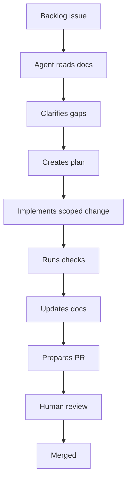

# Agent Workflow

## Purpose
Define how AI agents and human engineers coordinate work.

## Scope
Task planning, implementation, review, and handoff.

## Current status
Initial workflow.

## Lifecycle

## Rules
- Agents must not invent scientific requirements.
- Agents must preserve RAG grounding and passage citations.
- Agents must not introduce future-phase systems as MVP dependencies.
- Agents should update traceability when requirements change.

## Related documents
- [AGENTS](../../AGENTS.md)
- [Definition of ready](DEFINITION_OF_READY.md)
- [Definition of done](DEFINITION_OF_DONE.md)

## Human decisions still required
- Approve agent autonomy boundaries.
- Decide which agents can update governance docs.

