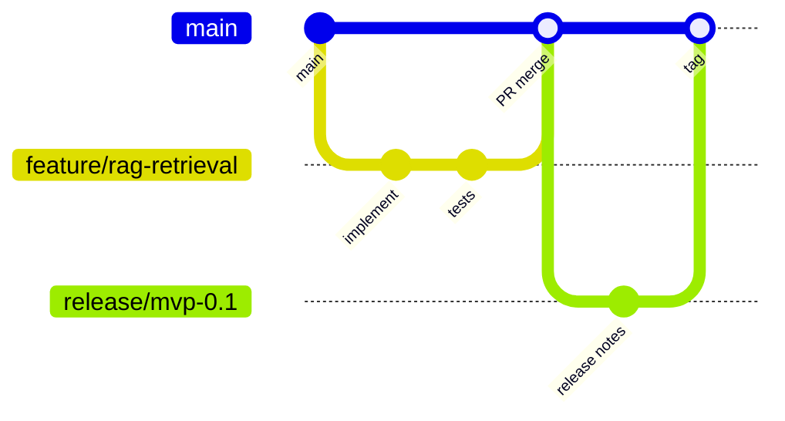

# Branching Strategy

## Purpose
Define how branches move from work to review to release.

## Scope
Git branch naming, pull request flow, and release branches.

## Current status
Initial strategy.

## Flow

## Branch naming
- `feature/<short-name>`
- `fix/<short-name>`
- `docs/<short-name>`
- `experiment/<short-name>`
- `release/<version>`

## Related documents
- [Pull request process](PULL_REQUEST_PROCESS.md)
- [Release process](../governance/RELEASE_PROCESS.md)
- [Contributing](../../CONTRIBUTING.md)

## Human decisions still required
- Confirm branch protection.
- Confirm squash versus merge commits.

