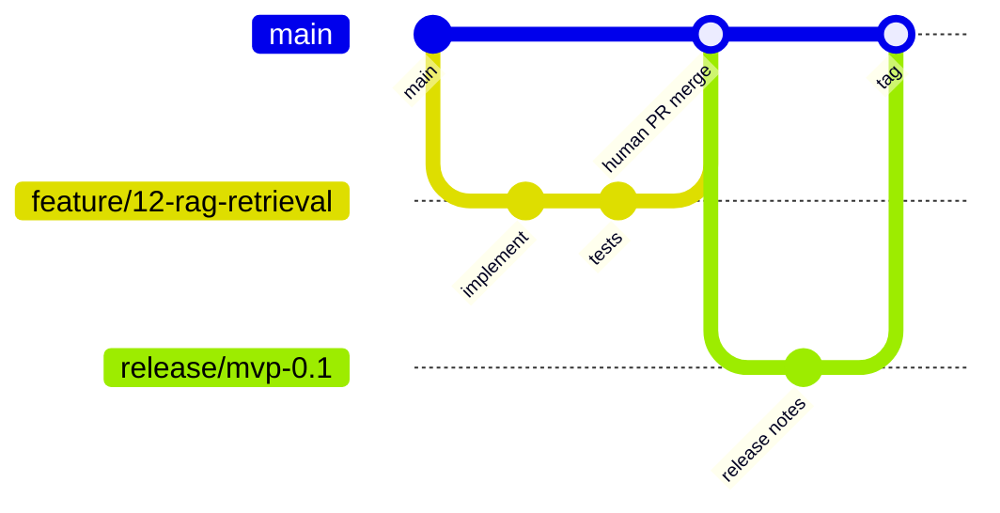

# Branching Strategy

## Purpose
Define how branches move from work to review to release.

## Scope
Git branch naming, pull request flow, and release branches for humans and agents.

## Current status
Active strategy. Agents must create one branch per issue and never push to `main`.

## Flow

## Branch naming
Include the issue number when available:

- `feature/<issue>-<short-name>`
- `fix/<issue>-<short-name>`
- `docs/<issue>-<short-name>`
- `test/<issue>-<short-name>`
- `chore/<issue>-<short-name>`
- `experiment/<issue>-<short-name>`
- `release/<version>`

Examples: `feature/42-citation-panel`, `fix/77-chunk-offsets`.

## Agent rules
- One branch per issue.
- Open a PR into `main`; do not push commits to `main`.
- Do not change branch protection settings.
- Humans approve and merge.
- **Branch isolation:** Never implement or commit on another contributor’s branch. Peer reviews are read-first (`gh pr diff` / throwaway review checkout). Do not stash, reset, or clean away someone else’s uncommitted or untracked WIP without explicit owner approval. See `.cursor/rules/agent-own-branch.mdc`.

## Related documents
- [AGENTS](../../AGENTS.md)
- [Pull request process](PULL_REQUEST_PROCESS.md)
- [Release process](../governance/RELEASE_PROCESS.md)
- [Contributing](../../CONTRIBUTING.md)

## Decision status
Resolved for August MVP (deadline 2026-08-31) or deferred post-August. See [decision log](../governance/DECISION_LOG.md).
