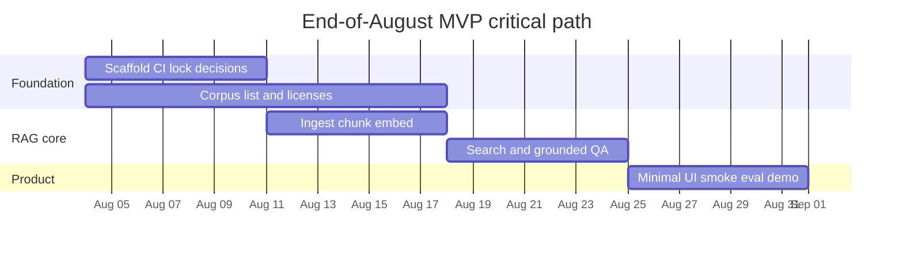

# Build Plan — Space Biology Evidence Engine

Living document for the AI HootCamp Summer 2026 Build Phase. Update this file as scope, milestones, or constraints change.

Supporting detail lives under [`docs/`](docs/README.md). This file is the assignment-facing plan: what we are building, why, when, and how we will execute it.

**MVP deadline:** 2026-08-31. Locked decisions: [DECISION_LOG.md](docs/governance/DECISION_LOG.md).

## Repositories

| Role | Repository |
|------|------------|
| **Principal / development** | [bluefate/spacebio-evidence-engine](https://github.com/bluefate/spacebio-evidence-engine) |
| **Course submission (GitHub Classroom)** | [FAU-AI-HootCamp-Summer-2026/buildphase-bluefate](https://github.com/FAU-AI-HootCamp-Summer-2026/buildphase-bluefate) |

Development and review happen in the principal repository. The Classroom repository is the official submission remote and must remain in sync for plan, design, and incremental build deliverables.

## Backlog and project (source of truth)

The week-by-week table in §3 is a **schedule**. Tasks, URLs, assignees, and board status are authoritative here:

| Resource | URL |
|----------|-----|
| **GitHub Project** | [Space Biology Evidence Engine (#6)](https://github.com/users/bluefate/projects/6) |
| **Issues** | [Repository issues](https://github.com/bluefate/spacebio-evidence-engine/issues) |
| **Backlog index (with issue URLs)** | [docs/governance/BACKLOG.md](docs/governance/BACKLOG.md) |
| **Traceability** | [docs/governance/TRACEABILITY_MATRIX.md](docs/governance/TRACEABILITY_MATRIX.md) |

Do not treat §3 as a substitute for claiming GitHub issues. Prefer Project column `Ready` → claim → branch → PR.

---

## 1. Project Summary

### Project title

**Space Biology Evidence Engine** — a citation-first, retrieval-augmented evidence workspace over a controlled corpus of open-access space biology publications.

### Problem statement and context

Public space biology publications are difficult to search, compare, and synthesize for focused scientific questions. Generic LLM answers risk hallucinated findings, weak provenance, and collapsed experimental context (organism, exposure, methods, limitations).

This project builds a trustworthy evidence engine that answers from retrieved corpus passages only, with passage-level citations and explicit insufficient-evidence behavior.

### Target users and stakeholders

| Stakeholder | Need |
|-------------|------|
| Researchers (priority) | Natural-language search, grounded Q&A with citations |
| Students / educators | Cited explanations for learning |
| Reviewers | Visible provenance and insufficient-evidence responses |
| Corpus maintainers | Reproducible ingestion from an approved manifest |
| Build-phase engineers / agents | Modular, testable RAG and API boundaries |

### Core value proposition

Solve **evidence search and synthesis with scientific provenance**: every claim links to a retrieved passage (publication, section, page, source location). The system must refuse to invent findings when the corpus is insufficient.

**Approved topic:** microgravity and skeletal muscle.  
**August MVP corpus size:** ~10–15 open-access publications (not 20–30).  
**Corpus selection rules:** include only OA papers with clear reuse rights, on-topic content, extractable methods/results, and citable metadata; exclude paywalled/unclear rights, off-topic, unusable extraction, and unapproved commentary. The paper list itself is a follow-on selection task.

**Detail:** [Product requirements](docs/product/PRODUCT_REQUIREMENTS.md), [User stories](docs/product/USER_STORIES.md), [Corpus specification](docs/data/CORPUS_SPECIFICATION.md), [Decision log](docs/governance/DECISION_LOG.md).

---

## 2. Requirements

### 2.1 Problem selection and technical specification

| Topic | Incorporation |
|-------|----------------|
| Domain research | Controlled space-biology corpus; citation rules in product and RAG docs |
| Stakeholders | Listed in §1; stories in [USER_STORIES.md](docs/product/USER_STORIES.md) |
| Constraints | Open-access only; no invented findings; local-first August MVP; Neo4j deferred |
| Challenges | PDF extraction quality, citation fidelity, corpus bias, hallucination risk — see [RISK_REGISTER.md](docs/governance/RISK_REGISTER.md) |
| Feasibility | Stack is Python/FastAPI + PostgreSQL/pgvector + Next.js; RAG path is well-understood for this corpus size |
| Architecture & diagrams | Summarized in [design.md](design.md); full set under [docs/architecture/](docs/architecture/ARCHITECTURE.md) |
| Tech stack justification | §2.1.1; locked in [DECISION_LOG.md](docs/governance/DECISION_LOG.md) |
| Schema & API | Logical schema in metadata/data docs; API sketch in [design.md](design.md) |
| Milestones | §3 (compressed to 2026-08-31) |
| Success metrics / KPIs | §2.1.2 |
| MVP vs nice-to-have | §2.1.3 |

#### 2.1.1 Technology stack (locked)

| Layer | Choice | Why |
|-------|--------|-----|
| Backend | Python 3.12+, FastAPI | Native fit for RAG, ingestion, evaluation |
| Database / vectors | PostgreSQL + pgvector | One store for relational data and embeddings |
| ORM / migrations | **SQLAlchemy 2.x + Alembic** | Mature migrations and queries |
| API schemas | **Pydantic** (not SQLModel) | Clear DB vs API boundary |
| Type checker | **pyright** | Primary type checker |
| PDF extraction | PyMuPDF | Practical text/page extraction; tables/figures out of August MVP |
| Embeddings | Sentence Transformers **`all-MiniLM-L6-v2`** (local) | Cost control; $0 cloud for embeddings |
| LLM | Provider abstraction; optional **OpenAI `gpt-4o-mini`**; **$50/mo hard cap**; local mode at $0 | Avoid lock-in; bound spend |
| Frontend | Next.js + TypeScript | Citation inspection UI |
| Local runtime | Docker Compose (`web`, `api`, `db`); ingest via **CLI/jobs** | Reproducible; no always-on worker in August |
| Quality | Pytest, Ruff, pyright, GitHub Actions | Testable retrieval and generation |
| License | Apache-2.0 | Confirmed |

#### 2.1.2 Success metrics and KPIs

| Area | Target (August MVP) |
|------|---------------------|
| Citation fidelity | Generated claims link only to retrieved passage IDs; invalid citations rejected |
| Evidence sufficiency | Insufficient-evidence path used when retrieval is weak |
| Retrieval quality | Draft 5–10 benchmark questions with measurable hit rate / citation precision |
| API latency | p95 &lt; 500 ms for non-LLM endpoints; LLM/RAG endpoints tracked separately with timeouts |
| DB queries | p95 &lt; 100 ms for indexed lookup/search paths where applicable |
| Reliability | Error rate &lt; 1% on non-LLM paths (local Compose) |
| Scientific integrity | No answers from model memory when corpus RAG is required |
| Cost | LLM spend ≤ $50/month; local mode $0 cloud |

#### 2.1.3 August MVP vs deferred

**Must ship by 2026-08-31**

- Controlled corpus ingest (~10–15 OA papers)
- Vector semantic retrieval (top-k 8; no hybrid, no reranker)
- Grounded Q&A with passage-level citations
- Insufficient-evidence responses
- Minimal web UI (ask, answer + citations, open passage)
- Tiny eval set (~5–10 questions) + smoke tests
- Local Docker Compose deployment

**Deferred past August**

- Study comparison UI
- Hybrid keyword retrieval; reranking
- Entity/relationship extraction; Neo4j / graph
- Tables/figures as first-class chunks
- Separate always-on worker service
- Public cloud deploy, auth/RBAC, Redis/CDN, production observability
- Advanced multi-agent orchestration and contradiction detection

### 2.2 Agentic AI and RAG

| Topic | Incorporation |
|-------|----------------|
| Vector store | **PostgreSQL + pgvector** |
| Ingestion & chunking | Manifest → PyMuPDF → section-aware chunks (~500–900 tokens, ~10–20% overlap) |
| Embeddings | `all-MiniLM-L6-v2`; model version stored with chunks |
| Semantic search | Vector-only for August |
| Agentic patterns | Thin service boundaries (search, retrieve, cite). Multi-agent deferred |
| User interaction | Web UI → FastAPI → retriever → sufficiency check → grounded generate → citation validation |
| Caching & fallbacks | Persist embeddings; on weak/failed retrieval return **insufficient evidence**, never fill with general model knowledge |

**Detail:** [RAG architecture](docs/architecture/RAG_ARCHITECTURE.md), [Chunking](docs/rag/CHUNKING_STRATEGY.md), [Retrieval](docs/rag/RETRIEVAL_STRATEGY.md), [Citations](docs/rag/CITATION_STRATEGY.md), [Prompting](docs/rag/PROMPTING_STRATEGY.md), [Evaluation](docs/rag/EVALUATION_STRATEGY.md).

### 2.3 Production engineering

| Topic | Plan |
|-------|------|
| Containerization | Dockerfiles + Compose for `web`, `api`, `db`; CLI ingest/eval jobs |
| Observability | Structured API/retrieval/ingestion logs; redacted prompts; production stack deferred |
| Database | Indexed publication/passage/chunk keys; Compose volume backups; regenerate-from-manifest |
| Caching | Embeddings persisted; Redis/CDN deferred |
| Infra docs & scripts | [LOCAL_SETUP.md](docs/operations/LOCAL_SETUP.md), [DEPLOYMENT.md](docs/operations/DEPLOYMENT.md), Makefile |
| Performance targets | As in §2.1.2; LLM paths have timeouts and user-visible loading/error states |

### 2.4 Security and costs

| Topic | Plan |
|-------|------|
| Secrets | Environment variables; `.env.example` only; no committed keys |
| Hardening | Parameterized SQL/ORM; treat publication text as untrusted; prompt-injection awareness |
| Auth | Out of August MVP (anonymous local use) |
| Cost | Local embeddings; $50/mo LLM hard cap; token/usage logging when OpenAI enabled |
| License | Apache-2.0 |

**Indicative monthly cost (August MVP):**

| Service | Local | If OpenAI enabled (within cap) |
|---------|-------|--------------------------------|
| Compute + Postgres (Compose) | $0 | $0 |
| Embeddings (local ST) | $0 | $0 |
| LLM completions | $0 | ≤ $50 hard cap |
| **Total** | **$0** | **≤ $50** |

---

## 3. Timeline and milestones

**Deadline: 2026-08-31.** Critical path: **corpus → ingest → embeddings → retrieval → grounded Q&A → citations UI → smoke/eval**.

### Week-by-week breakdown

| Window | Goals | Deliverables | Dependencies / blockers | Buffer notes |
|--------|-------|--------------|-------------------------|--------------|
| **Aug 4–10** | Scaffold, CI, locked decisions, start corpus list | Runnable `api`/`web`/`db` stubs; CI lint/typecheck/test; draft paper candidates | Topic/rules already approved | Keep scope to stubs |
| **Aug 11–17** | Ingest + chunk + embeddings | PDF extract → passages → chunks → pgvector for selected papers | License-cleared manifest entries | Reject poor extractions; ~10–15 papers |
| **Aug 18–24** | Search + grounded Q&A + citations | `/search`, `/ask`, sufficiency, citation validation | Embeddings ready | Vector-only; top-k 8 |
| **Aug 25–31** | Minimal UI, smoke/eval, demo | Ask UI; citation inspector; 5–10 benchmarks; docs sync | APIs ready | No compare UI; local demo only |

### Critical path and risks

- **Critical path:** corpus rights → extractability → embeddings → retrieval quality → citation-valid Q&A.
- **Highest risks:** hallucinated claims, citation mismatch, PDF quality, license uncertainty, scope creep — mitigations in [RISK_REGISTER.md](docs/governance/RISK_REGISTER.md).
- **Scope discipline:** features listed as deferred in §2.1.3 must not re-enter August work without an explicit decision-log change.

---

## 4. Documentation map

| Plan need | Primary docs |
|-----------|----------------|
| Decisions | [DECISION_LOG.md](docs/governance/DECISION_LOG.md) |
| Product | [PRODUCT_REQUIREMENTS.md](docs/product/PRODUCT_REQUIREMENTS.md), [USER_STORIES.md](docs/product/USER_STORIES.md) |
| Architecture | [ARCHITECTURE.md](docs/architecture/ARCHITECTURE.md), [design.md](design.md) |
| RAG | [docs/rag/](docs/rag/CHUNKING_STRATEGY.md) |
| Ops | [LOCAL_SETUP.md](docs/operations/LOCAL_SETUP.md), [DEPLOYMENT.md](docs/operations/DEPLOYMENT.md) |
| Governance | [PROJECT_ROADMAP.md](docs/governance/PROJECT_ROADMAP.md) |
| Agent process | [AGENTS.md](AGENTS.md), [AGENT_WORKFLOW.md](docs/development/AGENT_WORKFLOW.md) |

---

## 5. Change log

| Date | Change |
|------|--------|
| 2026-08-04 | Initial Build Phase `plan.md` created from existing documentation package |
| 2026-08-04 | Compressed to end-of-August MVP; locked stack, topic, cost, and feature cuts per decision log |
