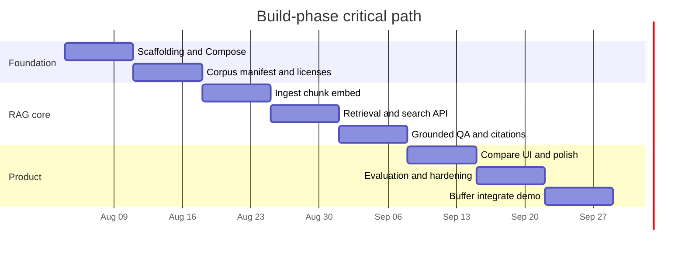

# Build Plan — Space Biology Evidence Engine

Living document for the AI HootCamp Summer 2026 Build Phase. Update this file as scope, milestones, or constraints change.

Supporting detail lives under [`docs/`](docs/README.md). This file is the assignment-facing plan: what we are building, why, when, and how we will execute it.

## Repositories

| Role | Repository |
|------|------------|
| **Principal / development** | [bluefate/spacebio-evidence-engine](https://github.com/bluefate/spacebio-evidence-engine) |
| **Course submission (GitHub Classroom)** | [FAU-AI-HootCamp-Summer-2026/buildphase-bluefate](https://github.com/FAU-AI-HootCamp-Summer-2026/buildphase-bluefate) |

Development and review happen in the principal repository. The Classroom repository is the official submission remote and must remain in sync for plan, design, and incremental build deliverables.

---

## 1. Project Summary

### Project title

**Space Biology Evidence Engine** — a citation-first, retrieval-augmented evidence workspace over a controlled corpus of open-access space biology publications.

### Problem statement and context

Public space biology publications are difficult to search, compare, and synthesize for focused scientific questions. Generic LLM answers risk hallucinated findings, weak provenance, and collapsed experimental context (organism, exposure, methods, limitations).

This project builds a trustworthy evidence engine that answers from retrieved corpus passages only, with passage-level citations and explicit insufficient-evidence behavior.

### Target users and stakeholders

| Stakeholder | Need |
|-------------|------|
| Researchers | Natural-language search, grounded Q&A, study comparison |
| Students / educators | Cited explanations for learning |
| Reviewers | Visible provenance and insufficient-evidence responses |
| Corpus maintainers | Reproducible ingestion from an approved manifest |
| Build-phase engineers / agents | Modular, testable RAG and API boundaries |

### Core value proposition

Solve **evidence search and synthesis with scientific provenance**: every claim links to a retrieved passage (publication, section, page, source location). The system must refuse to invent findings when the corpus is insufficient.

Recommended MVP topic: **microgravity and skeletal muscle**, ~20–30 open-access publications.

**Detail:** [Product requirements](docs/product/PRODUCT_REQUIREMENTS.md), [User stories](docs/product/USER_STORIES.md), [Corpus specification](docs/data/CORPUS_SPECIFICATION.md).

---

## 2. Requirements

### 2.1 Problem selection and technical specification

| Topic | Incorporation |
|-------|----------------|
| Domain research | Controlled space-biology corpus; citation and organism/exposure labeling rules in product and RAG docs |
| Stakeholders | Listed in §1; stories in [USER_STORIES.md](docs/product/USER_STORIES.md) |
| Constraints | Open-access only; no invented findings; local-first MVP; Neo4j deferred |
| Challenges | PDF extraction quality, citation fidelity, corpus bias, hallucination risk — see [RISK_REGISTER.md](docs/governance/RISK_REGISTER.md) |
| Feasibility | Stack is Python/FastAPI + PostgreSQL/pgvector + Next.js; RAG path is well-understood for this corpus size |
| Architecture & diagrams | Summarized in [design.md](design.md); full set under [docs/architecture/](docs/architecture/ARCHITECTURE.md) |
| Tech stack justification | §2.1.1 below and [ARCHITECTURE.md](docs/architecture/ARCHITECTURE.md) |
| Schema & API | Logical schema in metadata/data docs; API sketch in [design.md](design.md) |
| Weekly milestones | §3 |
| Success metrics / KPIs | §2.1.2 |
| MVP vs nice-to-have | §2.1.3 |

#### 2.1.1 Technology stack (justification)

| Layer | Choice | Why |
|-------|--------|-----|
| Backend | Python 3.12+, FastAPI | Native fit for RAG, ingestion, evaluation, scientific tooling |
| Database / vectors | PostgreSQL + pgvector | One store for relational data and embeddings; avoids a separate vector SaaS for MVP |
| ORM / migrations | SQLAlchemy or SQLModel + Alembic | Durable schema discipline (final ORM choice pending) |
| PDF extraction | PyMuPDF | Practical MVP text/page extraction |
| Embeddings | Sentence Transformers (local) | Cost control and offline-friendly path |
| LLM | Provider abstraction; OpenAI optional | Avoid lock-in; server-side calls only |
| Frontend | Next.js + TypeScript | Citation inspection UI |
| Local runtime | Docker Compose | Reproducible web, API, worker, DB |
| Quality | Pytest, Ruff, mypy/pyright, GitHub Actions | Testable retrieval and generation |

#### 2.1.2 Success metrics and KPIs

| Area | Target (MVP intent) |
|------|---------------------|
| Citation fidelity | Generated claims link only to retrieved passage IDs; invalid citations rejected |
| Evidence sufficiency | Insufficient-evidence path used when retrieval is weak |
| Retrieval quality | Benchmark questions with measurable hit rate / citation precision (see evaluation strategy) |
| API latency | p95 &lt; 500 ms for non-LLM endpoints; LLM/RAG endpoints tracked separately with timeouts |
| DB queries | p95 &lt; 100 ms for indexed lookup/search paths where applicable |
| Reliability | Error rate &lt; 1% on non-LLM paths; uptime goal &gt; 99.5% when publicly hosted |
| Scientific integrity | No answers from model memory when corpus RAG is required |

#### 2.1.3 MVP vs nice-to-have

**MVP**

- Controlled corpus ingest (~20–30 OA papers)
- Semantic (and optional hybrid) retrieval
- Grounded Q&A with passage-level citations
- Study comparison and metadata inspection
- Insufficient-evidence responses
- Evaluation harness with benchmark questions
- Local Docker Compose deployment

**Nice-to-have / future (explicitly deferred)**

- Neo4j / graph-native traversal
- Advanced multi-agent orchestration
- Advanced contradiction detection and curator workflows
- Production-grade auth/RBAC (unless later required for hosting)
- Full public cloud hardening beyond challenge needs

### 2.2 Agentic AI and RAG

| Topic | Incorporation |
|-------|----------------|
| Vector store | **PostgreSQL + pgvector** (not Pinecone/Weaviate/Chroma for MVP) |
| Ingestion & chunking | Manifest → PyMuPDF → section-aware chunks (~500–900 tokens overlapping, tune via eval) |
| Embeddings | Sentence Transformers; model version stored with chunks |
| Semantic search | Vector search; hybrid keyword if benchmarks require it |
| Agentic patterns | **Thin MVP:** tool-like service boundaries (search, retrieve, compare, cite). Full multi-agent orchestration is **deferred** |
| User interaction | Web UI → FastAPI → retriever → sufficiency check → grounded generate → citation validation |
| Caching & fallbacks | Cache embeddings and expensive retrieval where safe; on weak/failed retrieval return **insufficient evidence**, never fill with general model knowledge |

**Detail:** [RAG architecture](docs/architecture/RAG_ARCHITECTURE.md), [Chunking](docs/rag/CHUNKING_STRATEGY.md), [Retrieval](docs/rag/RETRIEVAL_STRATEGY.md), [Citations](docs/rag/CITATION_STRATEGY.md), [Prompting](docs/rag/PROMPTING_STRATEGY.md), [Evaluation](docs/rag/EVALUATION_STRATEGY.md).

### 2.3 Production engineering

| Topic | Plan |
|-------|------|
| Containerization | Dockerfiles + Compose for `web`, `api`, `worker`, `db`; see [CONTAINER_ARCHITECTURE.md](docs/architecture/CONTAINER_ARCHITECTURE.md) |
| Observability | Structured API/retrieval/ingestion logs; redacted prompts; future: tracing, dashboards, cost metrics — [OBSERVABILITY.md](docs/architecture/OBSERVABILITY.md) |
| Database | Indexed publication/passage/chunk keys; pooling via app server; backups per [BACKUP_AND_RECOVERY.md](docs/operations/BACKUP_AND_RECOVERY.md) |
| Caching | Embeddings persisted; optional Redis later for LLM/retrieval response cache; CDN only if public static hosting requires it |
| Infra docs & scripts | [LOCAL_SETUP.md](docs/operations/LOCAL_SETUP.md), [DEPLOYMENT.md](docs/operations/DEPLOYMENT.md), Makefile targets in [AGENTS.md](AGENTS.md) |
| Performance targets | As in §2.1.2; LLM paths exempt from the 500 ms p95 but must have timeouts and user-visible loading/error states |

### 2.4 Security and costs

| Topic | Plan |
|-------|------|
| Secrets | Environment variables; `.env.example` only; no committed keys; future secret manager for hosted deploy |
| Hardening | Parameterized SQL/ORM; validate uploads; treat publication text as untrusted; rate limits on public API; CORS; HTTPS in hosted env; prompt-injection awareness in RAG prompts |
| Cost optimization | Prefer local embeddings; token/usage logging; provider abstraction; small corpus; budget alerts when cloud LLMs enabled |
| Security audit | Dependency scanning in CI; review authz if/when accounts exist; document findings |
| Cost analysis (MVP estimate) | See table below |

**Indicative monthly cost (small MVP scale, subject to change):**

| Service | Local / free tier | Modest hosted usage |
|---------|-------------------|---------------------|
| Compute (API + web) | $0 (local) | ~$5–25 |
| Managed PostgreSQL | $0 (Compose) | ~$15–40 |
| Embeddings | $0 (local ST) | $0–10 if cloud |
| LLM completions | $0–20 (optional OpenAI) | $20–100 depending on traffic |
| Object storage / CDN | $0 | $0–10 |
| **Rough total** | **~$0–20** | **~$40–185** |

**Detail:** [SECURITY_ARCHITECTURE.md](docs/architecture/SECURITY_ARCHITECTURE.md), [SECURITY.md](SECURITY.md).

---

## 3. Timeline and milestones

Build phase is executed as weekly increments. Dates are planning targets and should be adjusted as the program calendar requires. Critical path: **corpus → ingest → embeddings → retrieval → grounded Q&A → citations UI → evaluation**.

### Week-by-week breakdown

| Week | Goals | Deliverables | Dependencies / blockers | Buffer notes |
|------|-------|--------------|-------------------------|--------------|
| **1** | Repo scaffolding, Compose services, project fields hygiene | Runnable `api`/`web`/`db` stubs; CI lint/test skeleton | None | Keep scope to stubs |
| **2** | Corpus selection and manifest | Approved topic + 20–30 OA entries with license status | Human topic/license approval | Do not ingest unclear rights |
| **3** | Ingestion pipeline | PDF/HTML extract → passages → DB; quality flags | Manifest from W2 | Reject poor extractions |
| **4** | Chunking + embeddings | Versioned chunks + pgvector rows | Ingestion from W3 | Tune sizes after first eval |
| **5** | Search / retrieval API | Semantic search endpoints; ranked passages with metadata | Embeddings from W4 | Add hybrid only if needed |
| **6** | Grounded Q&A + citations | Answer API; sufficiency check; citation validation; basic UI | Retrieval from W5 | Never answer from model memory |
| **7** | Study compare + UI polish | Comparison views; citation inspection UX | Q&A from W6 | Defer graph UI |
| **8** | Evaluation, hardening, demo readiness | Benchmarks; docs sync; deploy decision; demo path | Features from W5–W7 | Integration/debug buffer |

### Critical path and risks

- **Critical path:** corpus rights → extractability → embeddings → retrieval quality → citation-valid Q&A.
- **Highest risks:** hallucinated claims, citation mismatch, PDF quality, license uncertainty, scope creep (Neo4j/agents) — mitigations in [RISK_REGISTER.md](docs/governance/RISK_REGISTER.md).
- **Open human decisions:** topic approval, ORM/typechecker choices, model providers and cost caps, public deploy target — see README and architecture “decisions still required” sections.

---

## 4. Documentation map

| Plan need | Primary docs |
|-----------|----------------|
| Product | [PRODUCT_REQUIREMENTS.md](docs/product/PRODUCT_REQUIREMENTS.md), [USER_STORIES.md](docs/product/USER_STORIES.md) |
| Architecture | [ARCHITECTURE.md](docs/architecture/ARCHITECTURE.md), [design.md](design.md) |
| RAG | [docs/rag/](docs/rag/CHUNKING_STRATEGY.md) |
| Ops | [LOCAL_SETUP.md](docs/operations/LOCAL_SETUP.md), [DEPLOYMENT.md](docs/operations/DEPLOYMENT.md) |
| Governance | [PROJECT_ROADMAP.md](docs/governance/PROJECT_ROADMAP.md), [DECISION_LOG.md](docs/governance/DECISION_LOG.md) |
| Agent process | [AGENTS.md](AGENTS.md), [AGENT_WORKFLOW.md](docs/development/AGENT_WORKFLOW.md) |

---

## 5. Change log

| Date | Change |
|------|--------|
| 2026-08-04 | Initial Build Phase `plan.md` created from existing documentation package |
